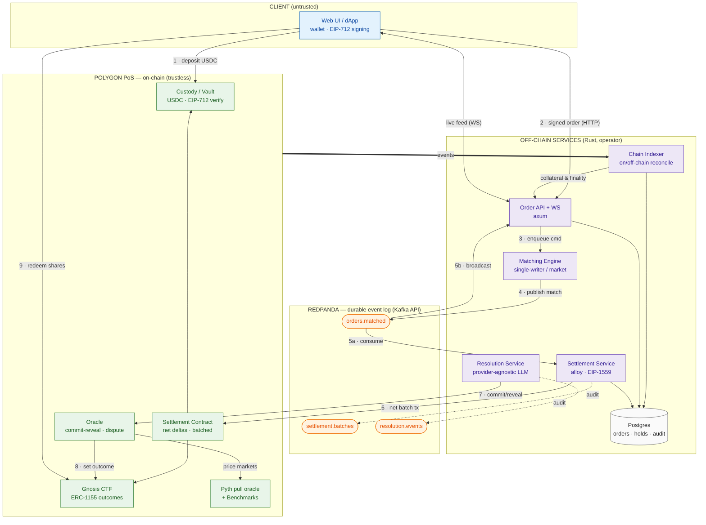
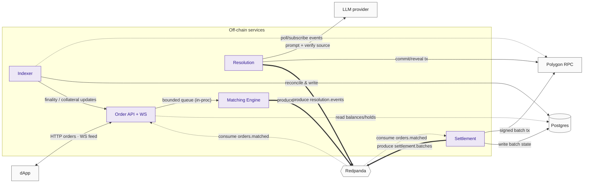
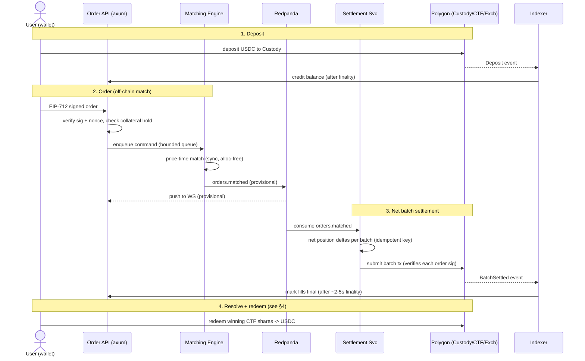
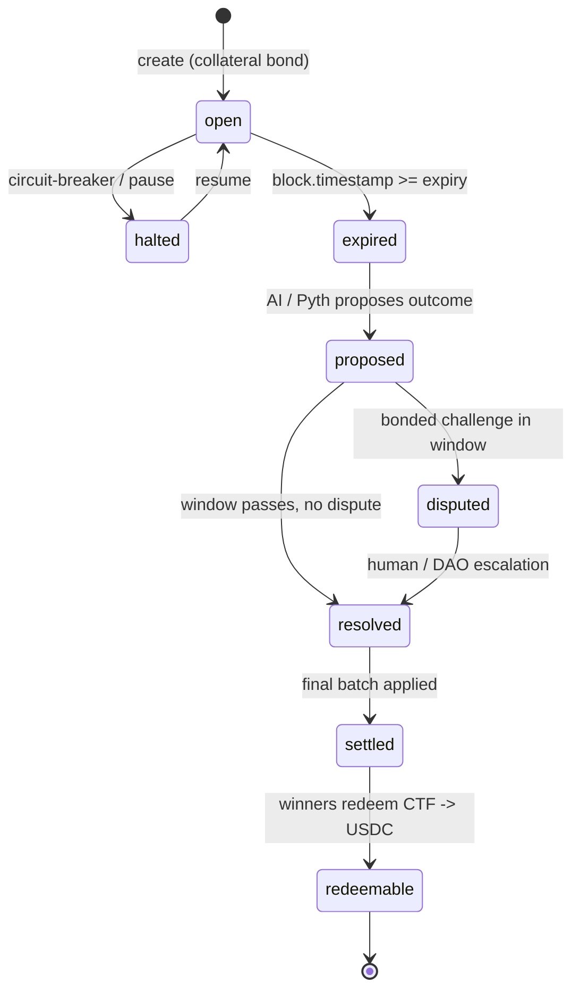
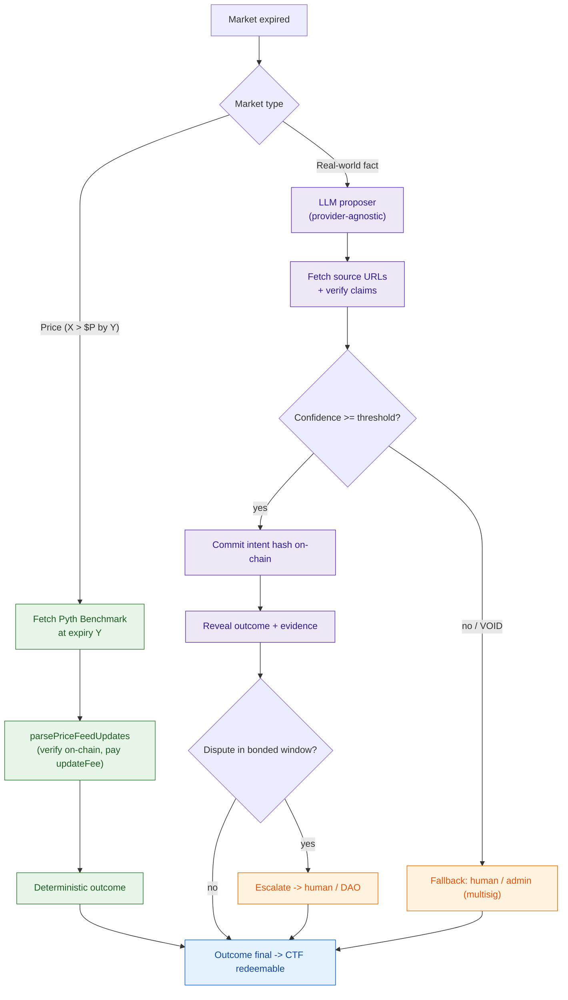
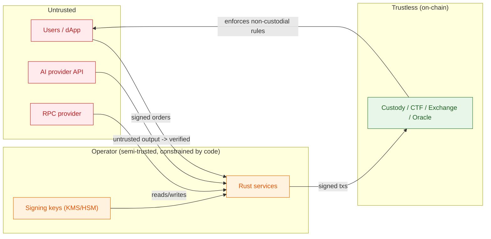

# Omniscient — System Architecture

> Scope: how the pieces fit and how money/state flows end-to-end. Reflects the locked decisions in `.devin/rules/omniscient.md` (Polygon PoS, off-chain Rust CLOB, Redpanda log, Pyth + AI optimistic-oracle resolution). MVP-first: fewest moving parts that are correct and fund-safe.

---

## 1. Component Overview

Numbered edges trace the **happy-path lifecycle** (deposit → trade → settle → resolve → redeem). Color = trust zone.

**Source of truth:** the chain (finalized state) is authoritative for funds, positions, and resolution. Off-chain state is provisional until finality and is reconciled by the indexer.

---

## 1a. Service Interactions (who talks to whom)

What each off-chain service exchanges, the transport, and the direction. Solid = command/data push, dashed = event consume, dotted = read.

**Read this as:** the Matching Engine never talks to the chain; the Settlement and Resolution services are the **only** writers to Polygon; the Indexer is the **only** path back from finalized chain state into off-chain services. Redpanda decouples produce/consume so a consumer outage never stalls matching.

---

## 2. End-to-End Trade Flow

⚠️ **INVARIANT:** the WS feed shows **provisional** matches. Clients must render fills as provisional until the indexer confirms finalized settlement. Broker exactly-once is within-broker only — the settlement→chain boundary has its own idempotency key + on-chain dedup.

---

## 3. Market Lifecycle (state machine)

Illegal transitions revert on-chain. Off-chain services treat state as authoritative only from finalized chain state. Expiry and dispute windows key off **on-chain block timestamp**, not the scheduler clock.

---

## 4. Resolution — Optimistic Oracle

Two paths depending on market type.

**Key properties:**

- **AI is a proposer, not the oracle.** Economic dispute + on-chain commit-reveal provide neutrality, not the model itself.
- **Never finalize on raw model output** — source fetch + claim verification is mandatory.
- **Pre-commitment binds** the concrete output + cited evidence; verification (not text regeneration) is the reproducible step. Temperature 0, but no assumption of bit-identical re-runs.
- Resolution latency (2–15s async) **never blocks settlement**.

---

## 5. Event / Topic Design (Redpanda)

| Topic | Producer | Consumers | Key | Notes |
|---|---|---|---|---|
| `orders.matched` | Matching Engine | Settlement, WS Broadcaster | `market_id` | Preserves per-market ordering; isolated consumer groups |
| `positions.updated` | Settlement | Indexer, API | `user_id` | Compacted |
| `settlement.batches` | Settlement | Indexer, audit | `batch_id` | Idempotency key per batch |
| `resolution.events` | Resolution | Indexer, audit | `market_id` | Versioned schema, legal/audit record |

Broker justified by **durability, replay, decoupling, audit** — not throughput. All payloads carry an explicit schema version; commit offsets after processing; DLQ for poison messages; bounded exponential backoff on retries.

---

## 6. Source-of-Truth & Reconciliation

| State | Provisional source | Authoritative source |
|---|---|---|
| Balances / collateral | API holds (Postgres) | Custody contract (via indexer, post-finality) |
| Fills / positions | `orders.matched` (WS) | Settlement contract / CTF (post-finality) |
| Market outcome | AI proposal / Pyth read | Oracle contract (post dispute window) |
| Order book | In-memory (Matching Engine) | Rebuilt from snapshot + replay-from-offset |

**Finality & reorg:** settlement is final only after Polygon deterministic finality (~2–5s, Heimdall v2). The indexer rolls back off-chain state on reorg before finality.

---

## 7. Fund-Safety Invariants (cross-cutting)

- **Solvency / conservation:** collateral pool ≥ total owed to winners at all times; matching, fees, settlement, and rounding never create or destroy value; rounding always favors the pool.
- **Non-custodial:** trades settle only from EIP-712-signed user orders; the operator cannot fabricate trades. Forced-withdrawal / escape hatch path preserved in v1 custody design.
- **Pre-trade collateralization:** orders enter the book only after available balance is verified against indexed on-chain custody; collateral is reserved on accept.
- **Fee↔solvency coupling:** maker rebate (0.1%) funded strictly by taker fee (0.5%) — net protocol fee ≥ 0 per match.
- **Settlement idempotency:** per-batch key + on-chain dedup so a retry cannot double-apply.
- **Backpressure:** bounded settlement backlog; slow/halt matching rather than let pre-settlement state diverge unbounded.
- **Crash recovery:** in-memory book rebuildable via periodic snapshot + replay-from-offset.

---

## 8. Trust Boundaries

- User input, AI output, and RPC responses are **untrusted** — validate/verify everything.
- Operator services are constrained by on-chain rules: they **cannot** move funds without user signatures.
- Privileged on-chain actions sit behind **multisig (Safe) + timelock**; pausable circuit-breaker on settlement, withdrawals, resolution.

⚠️ **COMPLIANCE:** prediction markets carry heavy regulatory exposure (US CFTC + state gambling law). Geofencing and legal review are first-class requirements — chain choice provides no regulatory cover.
