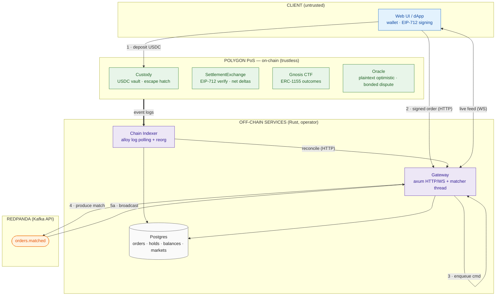

# Omniscient — System Architecture

Non-custodial, AI-resolved prediction market on Polygon PoS. Off-chain Rust CLOB with on-chain batched settlement via EIP-712 signed orders. Resolution via optimistic oracle with bonded dispute window.

**Units:** price `[0,1]` scaled to `1e6`; complete CTF outcome set = 1 USDC; winning share redeems for 1 USDC; USDC = 6 decimals.

## Documentation Index

| Document | Scope |
|---|---|
| [contracts.md](contracts.md) | On-chain Solidity contracts (Custody, SettlementExchange, Oracle) |
| [gateway.md](gateway.md) | Gateway binary — Order API, WebSocket, matcher thread |
| [indexer.md](indexer.md) | Chain Indexer — log ingestion, finalization, reorg rollback, reconciliation |
| [fund-safety.md](fund-safety.md) | Fund-safety invariants, state ownership, trust boundaries, compliance |
| [schema.md](schema.md) | Postgres schema — all tables, columns, relationships, reorg rollback, service ownership |

## Process Topology

Two Rust binaries + two stateful services, deployed via `docker-compose.yml`:

```
gateway      (Order API + WS + matcher thread, 1 binary)   :8080 public
indexer      (chain → off-chain reconciliation)              internal
redpanda     (single binary, no JVM/ZK)                     :9092 / :9644 / :8081
postgres                                                            :5432
```

Only `gateway:8080` is public. All other services are operator-internal.

## Crate Layout

```
backend/
  Cargo.toml          (workspace: shared, gateway, settlement, resolution, indexer)
  schema.sql          (Postgres DDL — all tables)
  shared/             (domain types, config, kafka, db, tracing, constants, error)
  gateway/            (axum HTTP/WS + crossbeam matcher thread)
  settlement/         (stub — deferred)
  resolution/         (stub — deferred)
  indexer/            (alloy log polling + reorg + finalization + event handlers)
contracts/
  foundry.toml        (solc 0.8.28, OZ v5.1.0, via_ir, cancun)
  src/                (Custody.sol, SettlementExchange.sol, Oracle.sol, interfaces/)
  test/               (Custody, CustodyInvariant, Oracle, SettlementExchange, CTFIntegration, Exploit)
```

## Global Topology



## Communication Matrix

| From                                    | To                 | Transport       | Payload                                    |
| -----------------------------------------| --------------------| -----------------| --------------------------------------------|
| dApp                                    | Gateway            | HTTP            | submit/cancel signed order                 |
| dApp                                    | Gateway            | WS              | subscribe live fills/book                  |
| dApp                                    | Custody            | RPC (wallet)    | deposit / withdraw / redeem                |
| Gateway                                 | Matcher thread     | IPC (crossbeam) | validated command stream                   |
| Gateway                                 | Redpanda           | KAFKA           | produce `orders.matched`                   |
| Redpanda                                | Gateway            | KAFKA           | consume `orders.matched` → WS              |
| Indexer                                 | Polygon RPC        | RPC             | poll logs, fetch blocks                    |
| Indexer                                 | Postgres           | SQL             | write reconciled state                     |
| Indexer                                 | Gateway            | HTTP            | `/internal/reconcile` (deposits, finality) |
| {gateway,indexer}                       | Postgres           | SQL             | operational state                          |

## Key Constants

| Constant | Value | Source |
|---|---|---|
| `PRICE_SCALE` | 1,000,000 | `shared/src/constants.rs` |
| `USDC_DECIMALS` | 6 | `shared/src/constants.rs` |
| `TAKER_FEE_BPS` | 50 (0.5%) | `shared/src/constants.rs` |
| `MAKER_REBATE_BPS` | 10 (0.1%) | `shared/src/constants.rs` |
| `FINALITY_BLOCKS` | 12 | `shared/src/constants.rs` |
| solc version | 0.8.28 | `foundry.toml` |
| EVM version | cancun | `foundry.toml` |
| CTF address (Amoy) | `0x69308FB512518e39F9b16112fA8d994F4e2Bf8bB` | `foundry.toml` |
| USDC address (Amoy) | `0x9c4E1703476E875070EE25b56A58B008CFb8FA78` | `foundry.toml` |
| Chain ID (Amoy) | 80002 | `.env.example` |
