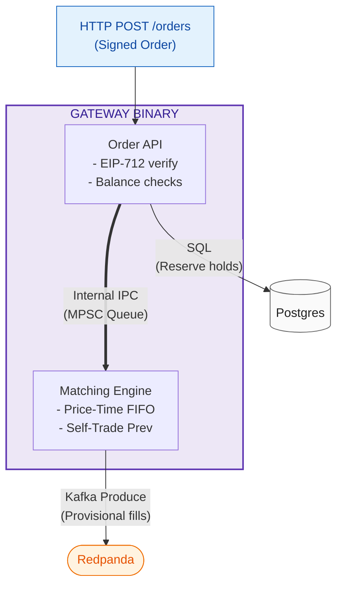
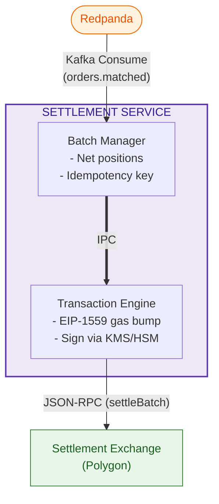
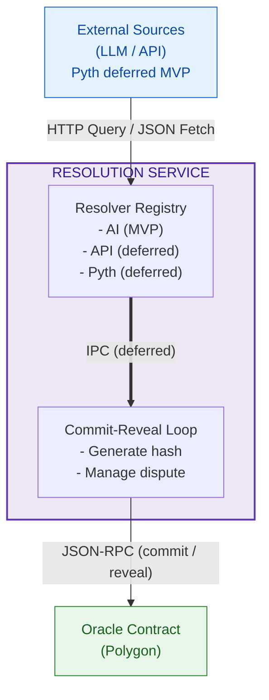
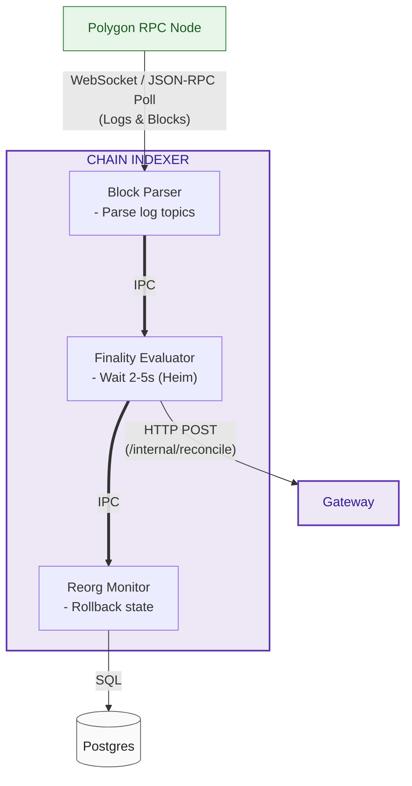
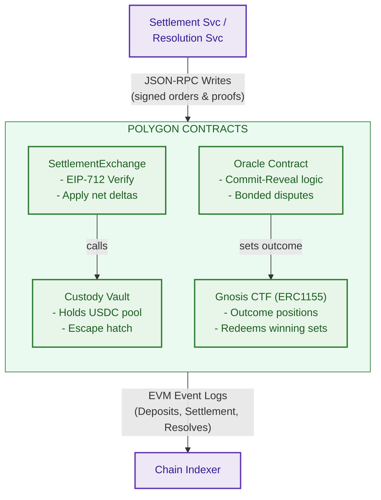
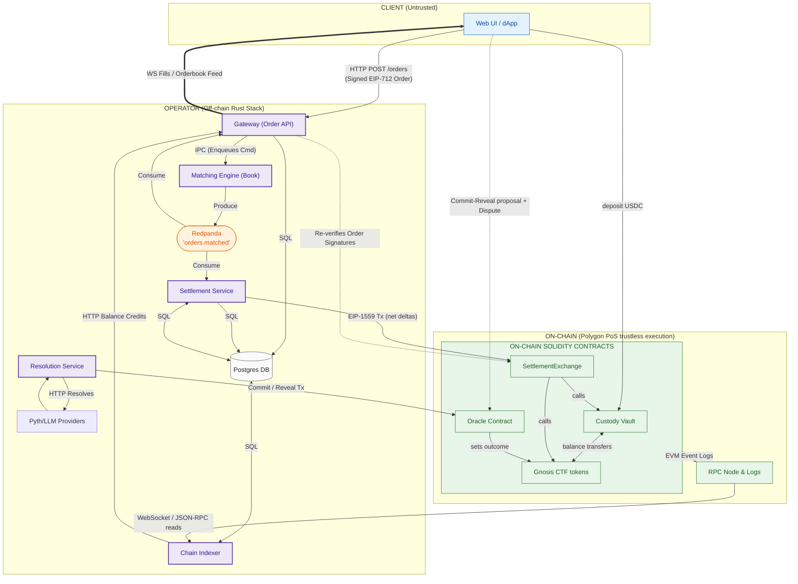

# Omniscient — System Architecture

This document defines the architectural components, their exact internal execution structures, individual boundary responsibilities, and the global communication flows of the Omniscient prediction market system.

---

## 1. Gateway (Order API & Matching Engine)

The Gateway acts as the public-facing entry point for user orders and WebSocket streaming feeds. It manages client authentication, in-memory state, and balance reservations.

### Key Responsibilities
- **Authentication & Validation:** Decodes and verifies EIP-712 order signatures against user addresses and checks sequential nonces.
- **Collateral Hold Reservation:** Checks availability of funds against indexed balances and locks required collateral in Postgres before the order is placed on the book to guarantee pre-trade collateralization.
- **Order Queueing:** Enqueues validated commands to an in-process bounded queue to prevent matching loop memory exhaustion.
- **Matching Execution:** Drives an allocation-free, single-writer matching loop enforcing strict price-time priority and self-trade prevention.
- **WebSocket Broadcast:** Consumes matching records from Redpanda to feed live order books and execution streams to clients.

---

## 2. Settlement Service

The Settlement Service is the operator-controlled worker responsible for bridging off-chain matches to the trustless ledger by preparing and dispatching batched transactions.

### Key Responsibilities
- **Delta Aggregation:** Consumes individual matched execution logs from Redpanda and nets position deltas per-user across a configurable batch size.
- **Idempotency Control:** Computes a unique batch hash and maps it to a database state tracking layer, guaranteeing exactly-once application at the chain boundary.
- **KMS Transaction Signing:** Dispatches transaction payloads to an HSM or cloud-managed KMS provider to isolate operator keys.
- **Priority-Fee Bumping:** Implements dynamic gas tracking using EIP-1559 fee structures, auto-replacing stuck transactions via incremental nonce-equivalent replacements.

---

## 3. Resolution Service

The Resolution Service operates as an asynchronous worker that manages market finalization through the resolver registry. **MVP is AI-only:** every market binds to the AI optimistic-oracle resolver. Deterministic on-chain sources (Pyth auto-finalize) and trusted-API sources are deferred post-MVP behind the same `Resolver` trait.

### Key Responsibilities
- **Resolver Registry Dispatch:** Routes expired markets to the **AI optimistic resolver** (MVP) inside a unified `Resolver` abstraction. Deterministic on-chain (Pyth) and trusted-API resolvers are deferred post-MVP behind the same trait.
- **On-Chain Proof Sourcing (post-MVP):** Would fetch historical Pyth Benchmark payloads on-demand at exact expiry intervals to pass to the Oracle's on-chain verifiers.
- **AI Claim Synthesis:** Directs LLM prompts, parses structured proposals, and verifies cited source URLs to generate cryptographic proof bundles.
- **Commit-Reveal Execution:** Generates commit hashes, schedules revealed payloads, and monitors active challenge/dispute windows.

---

## 4. Chain Indexer

The Chain Indexer is the unidirectional pipeline for synchronizing the finalized on-chain state back into the off-chain Postgres and Gateway execution spaces.

### Key Responsibilities
- **Log Parsing:** Subscribes to Polygon EVM execution logs, processing specific contract events (`Deposit`, `BatchSettled`, `OracleResolved`).
- **Finality Tracking:** Enforces a minimum blocks-to-finality delay (~2–5s, Heimdall v2) before propagating transaction updates.
- **Reorg Safe Synchronization:** Tracks chain depth and automatically rolls back unfinalized Postgres records in the event of a network chain reorg.
- **Credit Reconciliation:** Delivers balance-refresh instructions via private HTTP endpoints to notify the Gateway that deposits are safe to trade or batches have settled on-chain.

---

## 5. Smart Contracts (Polygon PoS)

The smart contracts are the ultimate source of truth, enforcing non-custodial ownership and cryptographic checks for user balances.

### Key Responsibilities
- **USDC Custody & Escape Hatch:** Vaults deposited ERC-20 collateral. Governs a time-delayed forced escape hatch when paused, allowing user-driven direct redemptions.
- **On-Chain Order Verification:** Re-evaluates order signatures and increments nonces directly on-chain within `SettlementExchange` to secure funds from operator manipulation.
- **Outcome Tokenization:** Leverages the Gnosis Conditional Tokens Framework (CTF) to split, merge, and redeem binary ERC-1155 outcome share sets against collateral reserves.
- **Economic Dispute Routing:** Holds dispute bonds and controls the state machine governing dispute timelines and human/DAO escalations.

---

## 6. Global Integrated Topology

The integrated global diagram displays the multi-zone flow of data, state, and cryptographically signed payloads.

