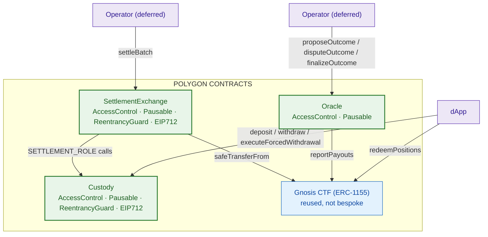
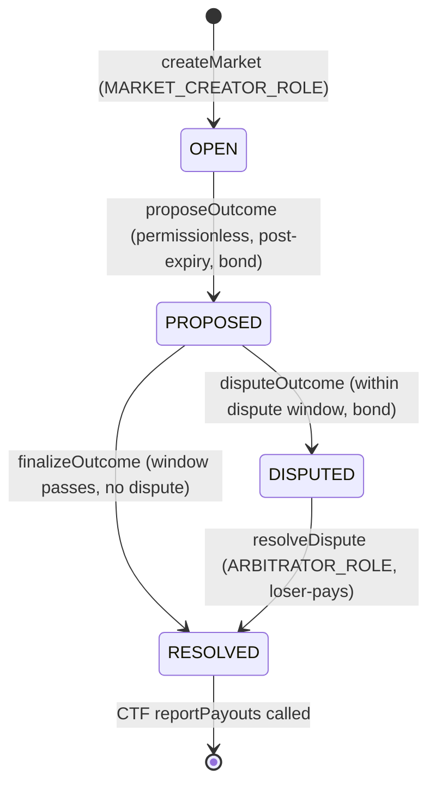

# On-Chain Contracts

Three bespoke Solidity contracts on Polygon PoS, plus the canonical Gnosis Conditional Tokens Framework (CTF) bound by address. Foundry-first; solc 0.8.28, OpenZeppelin v5.1.0, `via_ir`, cancun EVM.

## Contract Map



## Custody (`src/Custody.sol`)

Non-custodial USDC vault. Conservation invariant: `USDC.balanceOf(this) == totalCredited == sum(_balances)` at all times.

### Roles

| Role | Holder | Purpose |
|---|---|---|
| `DEFAULT_ADMIN_ROLE` | deployer / Safe multisig | grant roles, set inactivity threshold |
| `PAUSER_ROLE` | Safe multisig | pause/unpause |
| `SETTLEMENT_ROLE` | SettlementExchange contract | `applyNetDeltas`, `heartbeat` |
| `WITHDRAWAL_SIGNER_ROLE` | operator KMS/HSM key | authorize fast withdrawals |

### Functions

| Function | Access | Description |
|---|---|---|
| `deposit(amount)` | public | transfers USDC from caller, credits `_balances[caller]` |
| `withdraw(amount, deadline, operatorSig)` | public | operator-authorized fast withdrawal; funds go to `msg.sender` only |
| `executeForcedWithdrawal(to)` | public | escape hatch; unlocks only after operator inactivity threshold |
| `applyNetDeltas(batchId, BalanceDelta[])` | `SETTLEMENT_ROLE` | batched net USDC deltas; idempotent per `batchId`; requires sum == 0 |
| `heartbeat()` | `SETTLEMENT_ROLE` | refreshes operator liveness clock |
| `setOperatorInactivityThreshold(threshold)` | `DEFAULT_ADMIN_ROLE` | 1–90 days |
| `pause()` / `unpause()` | `PAUSER_ROLE` | circuit breaker |
| `balanceOf(account)` | view | returns `_balances[account]` |
| `withdrawalNonce(account)` | view | returns current withdrawal nonce |
| `isBatchApplied(batchId)` | view | returns whether batch was applied |
| `domainSeparator()` | view | returns EIP-712 domain separator |

### Key Properties

- **Non-custodial:** operator signature authorizes *whether/how much* to withdraw, never the destination. A rogue operator cannot reroute funds.
- **Escape hatch:** `executeForcedWithdrawal` works even when paused (liveness only refreshable while unpaused). Unlocks after `operatorInactivityThreshold` silence.
- **Conservation:** `applyNetDeltas` reverts if deltas sum != 0. Idempotent via `_appliedBatches[batchId]`.
- **EIP-712:** withdrawal authorization uses `Withdrawal(address account, uint256 amount, uint256 nonce, uint256 deadline)` with domain `"Omniscient Custody"` / `"1"`.

### Events

`Deposited`, `Withdrawn`, `ForcedWithdrawalExecuted`, `NetDeltasApplied`, `OperatorHeartbeat`, `OperatorInactivityThresholdUpdated`

### Tests

`Custody.t.sol` (unit), `CustodyInvariant.t.sol` (invariant/fuzz — conservation over 32k calls), `Exploit.t.sol`

---

## SettlementExchange (`src/SettlementExchange.sol`)

Batch-settles matched orders by verifying each maker's EIP-712 signature on-chain. All USDC/CTF movement is derived on-chain from signed orders — the operator supplies no deltas.

### Roles

| Role | Holder | Purpose |
|---|---|---|
| `DEFAULT_ADMIN_ROLE` | deployer / Safe multisig | set fee rates, withdraw fees |
| `PAUSER_ROLE` | Safe multisig | pause/unpause |
| `OPERATOR_ROLE` | Operator key (settlement service — deferred) | `settleBatch` |

### Order Struct

```solidity
struct Order {
    bytes32 salt;
    address maker;
    uint256 positionId;
    uint256 price;    // [0, 1e6]
    uint256 amount;
    uint8 side;       // 0 = buy, 1 = sell
    uint256 nonce;    // cancellation epoch
    uint256 deadline;
}
```

`ORDER_TYPEHASH = keccak256("Order(bytes32 salt,address maker,uint256 positionId,uint256 price,uint256 amount,uint8 side,uint256 nonce,uint256 deadline)")`

EIP-712 domain: `"Omniscient Exchange"` / `"1"`.

### Functions

| Function | Access | Description |
|---|---|---|
| `settleBatch(batchId, SignedOrder[], fills[], isMaker[])` | `OPERATOR_ROLE` | verifies each order sig + nonce + deadline + overfill; accrues USDC deltas; applies via Custody; transfers CTF shares |
| `setFeeRates(takerFeeBps, makerRebateBps)` | `DEFAULT_ADMIN_ROLE` | max 1000 bps each |
| `withdrawFees(amount, to, deadline, sig)` | `DEFAULT_ADMIN_ROLE` | withdraws accrued fees from Custody |
| `cancelAllOrders()` | public (caller = maker) | bumps `nonces[maker]` to mass-invalidate outstanding signed orders |
| `pause()` / `unpause()` | `PAUSER_ROLE` | circuit breaker |
| `onERC1155Received` / `onERC1155BatchReceived` | — | ERC-1155 receiver hooks |

### Settlement Flow

```mermaid
sequenceDiagram
    participant ST as Operator (deferred)
    participant SE as SettlementExchange
    participant CV as Custody
    participant CTF as Gnosis CTF

    ST->>SE: settleBatch(batchId, orders[], fills[], isMaker[])
    SE->>SE: check batchId not settled (idempotent)
    loop each order
        SE->>SE: verify EIP-712 sig recovers to maker
        SE->>SE: check deadline, nonce epoch, overfill
        SE->>SE: accrue USDC delta (buy: pay volume+fee; sell: receive volume-fee)
        SE->>SE: track exchangeUsdcNet
    end
    SE->>SE: assert exchangeUsdcNet >= 0 (pool never net-pays)
    SE->>SE: append exchange balancing leg (deltas sum == 0)
    SE->>CV: applyNetDeltas(batchId, deltas[])
    SE->>SE: verify per-position CTF net == 0 (pure passthrough)
    SE->>CTF: safeTransferFrom sellers → exchange (pull sells)
    SE->>CTF: safeTransferFrom exchange → buyers (push buys)
```

### Invariants Enforced On-Chain

1. **`exchangeUsdcNet >= 0`** — taker fees fund maker rebates; net protocol fee >= 0 per batch. Reverts `ExchangeUsdcNetNegative`.
2. **Per-position CTF net == 0** — exchange is a pure passthrough; cannot drain or strand inventory. Reverts `CtfNotConserved`.
3. **Rounding favors the pool:** buy volume rounds UP, sell rounds DOWN; taker fee rounds UP, maker rebate rounds DOWN.

### Tests

`SettlementExchange.t.sol` — Success, withdrawFees, ExchangeUsdcNetNegative revert, CtfNotConserved revert. `CTFIntegration.t.sol` — fork test against canonical Polygon CTF (requires Amoy RPC).

---

## Oracle (`src/Oracle.sol`)

Plaintext optimistic resolution with bonded dispute window. No commit-reveal (deferred post-MVP).

### Roles

| Role | Holder | Purpose |
|---|---|---|
| `DEFAULT_ADMIN_ROLE` | deployer / Safe multisig | grant roles |
| `PAUSER_ROLE` | Safe multisig | pause/unpause |
| `ARBITRATOR_ROLE` | Safe multisig / DAO | `resolveDispute` (escalation) |
| `MARKET_CREATOR_ROLE` | authorized creator | `createMarket` |

### Market State Machine



### Functions

| Function | Access | Description |
|---|---|---|
| `createMarket(marketId, ResolutionSpec)` | `MARKET_CREATOR_ROLE` | calls `ctf.prepareCondition`, stores spec |
| `proposeOutcome(marketId, payouts)` | permissionless | requires `OPEN` + expired; pulls `bondAmount` USDC; stores hash + proposer + time |
| `disputeOutcome(marketId, reasoning)` | permissionless | requires `PROPOSED` + within window; pulls `bondAmount` USDC |
| `resolveDispute(marketId, payouts)` | `ARBITRATOR_ROLE` | loser-pays (both bonds to winner); calls `ctf.reportPayouts` |
| `finalizeOutcome(marketId, payouts)` | permissionless | requires `PROPOSED` + window passed; verifies hash matches; refunds proposer bond; calls `ctf.reportPayouts` |
| `pause()` / `unpause()` | `PAUSER_ROLE` | circuit breaker |

### ResolutionSpec

```solidity
struct ResolutionSpec {
    bytes32 questionId;
    uint256 outcomeSlotCount;
    uint256 expiry;         // on-chain block timestamp
    uint256 disputeWindow;  // seconds from proposeTime
    uint256 bondAmount;     // USDC, pulled from proposer and disputer
}
```

### Key Properties

- **Plaintext propose:** payouts are public from proposal; no reveal step. Removes unreveal-griefing/liveness vector.
- **Bond economics:** proposer posts `bondAmount`; disputer posts `bondAmount`. Winner gets `2 * bondAmount`. Undisputed → proposer refunded.
- **Payout validation:** `_validatePayouts` checks `length == outcomeSlotCount` and `sum != 0`.
- **Off-chain integrity hash:** off-chain proposer computes `keccak256(marketId ++ payouts)` for audit — not an on-chain commitment (service deferred).

### Events

`MarketCreated`, `OutcomeProposed`, `OutcomeDisputed`, `OutcomeResolved`, `DisputeResolved`

### Tests

`Oracle.t.sol` — 24 tests covering create, propose, dispute, finalize, resolve, validation, access control, pause.

---

## Gnosis CTF (`IConditionalTokens.sol`)

Minimal 0.8.x ABI binding for the canonical Gnosis Conditional Tokens Framework (deployed as 0.5.x bytecode). Bound by address, never compiled from upstream.

### Key Functions Used

| Function | Called by | Purpose |
|---|---|---|
| `prepareCondition(oracle, questionId, outcomeSlotCount)` | Oracle.`createMarket` | registers condition |
| `reportPayouts(questionId, payouts[])` | Oracle.`finalizeOutcome` / `resolveDispute` | sets outcome |
| `safeTransferFrom(from, to, id, amount, data)` | SettlementExchange.`_settleCtf` | moves ERC-1155 outcome shares |
| `redeemPositions(...)` | dApp (user wallet) | winner redeems shares for USDC |

### Addresses (Polygon Amoy)

- CTF: `0x69308FB512518e39F9b16112fA8d994F4e2Bf8bB`
- USDC: `0x9c4E1703476E875070EE25b56A58B008CFb8FA78`
