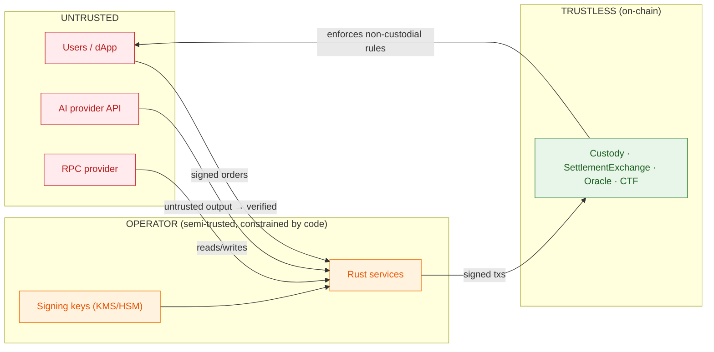

# Fund-Safety Invariants, State Ownership & Trust Boundaries

## Fund-Safety Invariants (non-negotiable)

- **Solvency / conservation:** collateral pool ≥ total owed to winners at all times. Matching, fees, settlement, and rounding never create or destroy value. **Rounding always favors the pool.**
  - On-chain: `Custody` conservation (`USDC.balanceOf(this) == sum(_balances)`), `SettlementExchange` `exchangeUsdcNet >= 0`, per-position CTF net == 0.
  - Off-chain: `shared::constants` — `TAKER_FEE_BPS = 50`, `MAKER_REBATE_BPS = 10`. Maker rebate funded strictly by taker fee → net protocol fee ≥ 0 per match.

- **Non-custodial:** trades settle only from EIP-712-signed user orders. The operator cannot fabricate trades — every settled delta traces to a user signature verified on-chain. A **forced-withdrawal escape hatch** is preserved in `Custody`: `executeForcedWithdrawal` unlocks after `operatorInactivityThreshold` silence (1–90 days), works even when paused.

- **Pre-trade collateralization:** orders enter the book only after balance is verified against indexed on-chain custody; collateral is reserved on accept; withdrawals exclude held collateral; deposits credited only after finality.

- **Settlement idempotency:** per-batch `batchId` + on-chain dedup (`_settledBatches` in `SettlementExchange`, `_appliedBatches` in `Custody`) so a retry cannot double-apply.

- **Backpressure:** bounded backlog; slow/halt matching rather than let pre-settlement state diverge unbounded.

- **Canonical time:** expiry and dispute windows key off **on-chain block timestamp**, not the scheduler clock.

## State Ownership

| State | Provisional source | Authoritative source |
|---|---|---|
| Balances / collateral | Gateway holds (Postgres `balances`) | Custody contract (via Indexer, post-finality) |
| Fills / positions | `orders.matched` (WS, provisional) | SettlementExchange / CTF (post-finality) |
| Market outcome | Oracle events (via Indexer) | Oracle contract — post dispute window or arbitrator resolution |
| Order book | In-memory (matcher thread) | Rebuilt from snapshot + replay-from-offset |

## Reorg Handling

The Indexer tracks `reorg_checkpoints` for every processed block. On finalization (`current_block - block_num >= 12`), it compares the stored block hash against the RPC. On mismatch:

1. `rollback_unfinalized(block_num)` deletes: `reorg_checkpoints`, `indexed_logs`, `balances`, `markets` — all rows with `block_number >= block_num`.
2. Cursor is not advanced; the block is reprocessed on the next poll cycle.

Pre-finality state is never treated as authoritative. Clients render pre-settlement matches as **provisional**.

## Crash Recovery

- In-memory order book: rebuildable via replay-from-offset (Redpanda `kafka_offset`); open orders persisted in `orders` table.
- Indexer: `indexer_cursors` + `indexed_logs` provide idempotent reprocessing.

## Trust Boundaries

- User input, AI output, and RPC responses are **untrusted** — validate/verify everything.
- Operator services are constrained by on-chain rules: they **cannot** move funds without user signatures.
- Privileged on-chain actions sit behind **Safe multisig + timelock**; a pausable circuit-breaker covers settlement, withdrawals, and resolution.
- Operator signing keys (settlement, resolution) live in **KMS/HSM** — never user funds.

## Access Control

| Contract | Role | Holder |
|---|---|---|
| Custody | `DEFAULT_ADMIN_ROLE` | Safe multisig |
| Custody | `PAUSER_ROLE` | Safe multisig |
| Custody | `SETTLEMENT_ROLE` | SettlementExchange contract |
| Custody | `WITHDRAWAL_SIGNER_ROLE` | Operator KMS/HSM key |
| SettlementExchange | `DEFAULT_ADMIN_ROLE` | Safe multisig |
| SettlementExchange | `PAUSER_ROLE` | Safe multisig |
| SettlementExchange | `OPERATOR_ROLE` | Settlement Service operator key |
| Oracle | `DEFAULT_ADMIN_ROLE` | Safe multisig |
| Oracle | `PAUSER_ROLE` | Safe multisig |
| Oracle | `ARBITRATOR_ROLE` | Safe multisig / DAO |
| Oracle | `MARKET_CREATOR_ROLE` | Authorized creator |

## Redpanda Topics

| Topic | Partitions | Producer | Consumers | Key |
|---|---|---|---|---|
| `orders.matched` | 8 | Gateway (matcher) | Gateway (WS) | `market_id` |

All payloads carry `schema_version` via `shared::kafka::payload_with_version`. Offsets committed **after** processing. `enable.auto.commit = false`.

⚠️ **INVARIANT:** broker exactly-once is **within-broker only** — it does not extend across the chain boundary. On-chain idempotency (`_settledBatches`, `_appliedBatches`) is the dedup boundary.

## Compliance

⚠️ **COMPLIANCE:** prediction markets carry heavy regulatory exposure (US CFTC + state gambling law). **Geofencing and legal review are first-class, present requirements** — chain choice provides no regulatory cover.

## Testing

| Layer | Tooling | Scope |
|---|---|---|
| Solidity unit | Foundry `forge test` | Custody, SettlementExchange, Oracle |
| Solidity invariant/fuzz | Foundry invariant | Custody conservation (32k calls), fee/rounding |
| Solidity fork | Foundry fork (Amoy) | CTFIntegration (requires RPC) |
| Rust | `cargo test` | shared domain types |
| CI | `.github/workflows/contracts.yml` | forge build/test/fmt + Slither |
