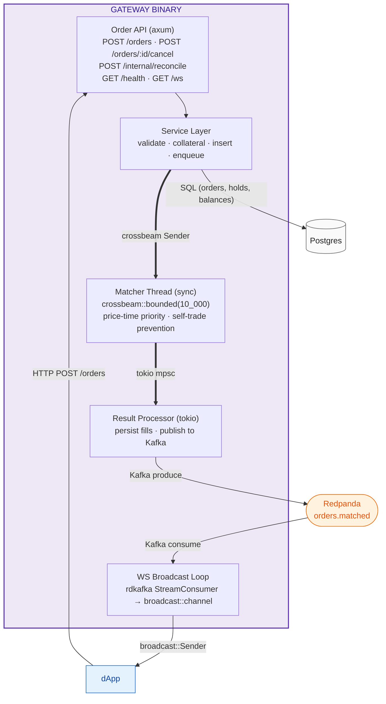
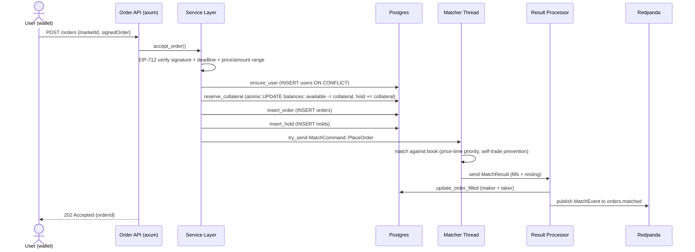
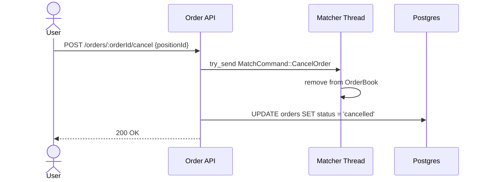
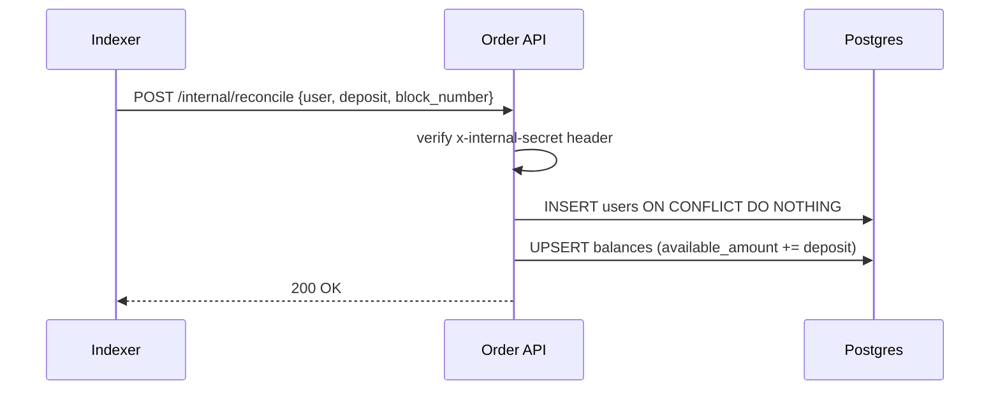

# Gateway

Public-facing entry point for user orders and WebSocket streaming. Single binary combining axum HTTP/WS server with a dedicated sync matcher thread.

**Source:** `backend/gateway/src/main.rs`
**Port:** `:8080` (only public service)
**Dependencies:** Postgres, Redpanda, crossbeam channel

## Module Layout

| Module | Responsibility |
|---|---|
| `main.rs` | Wiring: config init, DB pool, Kafka producer, book rebuild, thread spawn, graceful shutdown |
| `api.rs` | HTTP/WS handlers, router, `AppError`, `ws_broadcast_loop` |
| `service.rs` | `AppState`, order acceptance flow (validate → collateral → insert → enqueue), result processor, book rebuild |
| `engine.rs` | Sync matcher thread: `MatchCommand`, `run_matcher` — owns all `OrderBook`s, no tokio/locks/I/O |
| `domain.rs` | Pure order book logic: `OrderBook`, `RestingOrder`, `Fill`, `MatchResult`, fee/volume math |
| `infra.rs` | DB queries (orders, holds, balances), Kafka `MatchEvent` publish |

## Architecture

## Endpoints

| Method | Path | Auth | Description |
|---|---|---|---|
| POST | `/orders` | — | submit signed order: EIP-712 verify, collateralize, insert, enqueue to matcher |
| POST | `/orders/:order_id/cancel` | — | cancel resting order by ID |
| POST | `/internal/reconcile` | `x-internal-secret` header | called by Indexer to credit deposits post-finality; upserts `users` + `balances` |
| GET | `/health` | — | checks Postgres `SELECT 1` + Kafka metadata fetch; returns `{status, db, kafka}` |
| GET | `/ws` | — | WebSocket upgrade; subscribes to `broadcast::Receiver<Value>` fed by Kafka consumer |

## Matcher Thread

Sync `std::thread` (not tokio) receiving `MatchCommand` from `crossbeam::channel::bounded(10_000)`. Owns all `OrderBook` instances keyed by `position_id`. No locks, no DB I/O, no heap allocation in the hot path.

**Order types:** GTC limit only (MVP). IOC/FOK/post-only deferred.

**Matching rules:**
- **Price-time priority:** `BTreeMap<u64, VecDeque<RestingOrder>>` per side. Buys sorted descending (best bid = highest), sells ascending (best ask = lowest). FIFO within each price level via `seq` counter.
- **Self-trade prevention:** if taker address matches maker address, the resting order is skipped (popped from front, not matched).
- **Partial fills:** if incoming order is not fully filled, the remainder rests in the book.

**Commands:** `PlaceOrder`, `CancelOrder`, `CancelAll`, `Shutdown`.

**Result channel:** `tokio::sync::mpsc::UnboundedSender<MatchResult>` — the engine sends match results to the async result processor for persistence and Kafka publishing.

## Result Processor

Async tokio task consuming `MatchResult` from the engine. For each fill:
1. Publishes `MatchEvent` to Redpanda `orders.matched`
2. Updates maker order `filled_amount` + status in Postgres
3. Updates taker order `filled_amount` + status in Postgres

## Crash Recovery

On startup, the gateway queries all `status = 'open'` orders from Postgres ordered by `created_at ASC` and rebuilds `OrderBook` instances per `position_id`. No snapshot machinery — DB is the source of truth for resting orders.

## WS Broadcast Loop

Async tokio task consuming from Redpanda topic `orders.matched` (consumer group `gateway-ws-group`). Each message is parsed as JSON and sent via `broadcast::channel(1024)`. Commits offsets asynchronously after processing.

## Order Submission Flow

## Cancel Flow

## Reconcile Flow

## Pre-trade Collateralization

- **BUY orders:** USDC collateral = `ceil(amount * price / 1e6)` (rounds up)
- **SELL orders:** CTF share collateral = `amount`
- **Reservation:** atomic `UPDATE balances SET hold_amount += X, available_amount -= X WHERE available_amount >= X` — fails if insufficient balance
- **On cancel:** collateral released back to `available_amount`
- **On fill:** collateral consumed (applied toward settlement)

## Fee Math

- **Taker fee:** `volume * TAKER_FEE_BPS / 10000` (rounds up, 50 bps)
- **Maker rebate:** `volume * MAKER_REBATE_BPS / 10000` (rounds down, 10 bps)
- **Invariant:** net protocol fee ≥ 0 per match (taker fee funds maker rebate)
- **Volume:** buy = `ceil(amount * price / SCALE)`, sell = `floor(amount * price / SCALE)`

## Shared Domain Types

The `shared` crate (`backend/shared/src/domain.rs`) provides:

- **`Address`** — `[u8; 20]` newtype with hex serde
- **`MarketId`** — `[u8; 32]` newtype with hex serde
- **`Bytes32`** — `[u8; 32]` newtype with hex serde
- **`Price`** — `u64` newtype, `SCALE = 1_000_000`
- **`Quantity`** — `u64` newtype
- **`OrderId`** — `Uuid` newtype
- **`BatchId`** — `[u8; 32]` newtype
- **`OrderSide`** — enum `Buy = 0`, `Sell = 1`
- **`Order`** — mirrors `SettlementExchange.Order` (`salt`, `maker`, `position_id`, `price`, `amount`, `side`, `nonce`, `deadline`)
- **`SignedOrder`** — `Order` + `Vec<u8>` signature
- **EIP-712 helpers:** `compute_domain_separator`, `hash_order`, `eip712_signing_hash`, `verify_order_signature`

## Configuration

Loaded from environment via `shared::config::AppConfig`:

- `GATEWAY_BIND` — listen address (default `0.0.0.0:8080`)
- `GATEWAY_INTERNAL_SECRET` — shared secret for `/internal/reconcile`
- `DATABASE_URL`, `KAFKA_BROKERS`, `RPC_URL`, `CHAIN_ID`
- Contract addresses: `CUSTODY_ADDR`, `SETTLEMENT_EXCHANGE_ADDR`, `ORACLE_ADDR`, `CTF_ADDR`, `USDC_ADDR`
- `OPERATOR_KEY` — hex private key (dev only; KMS in production)
- `LOG_FORMAT` — `pretty` or `json`
