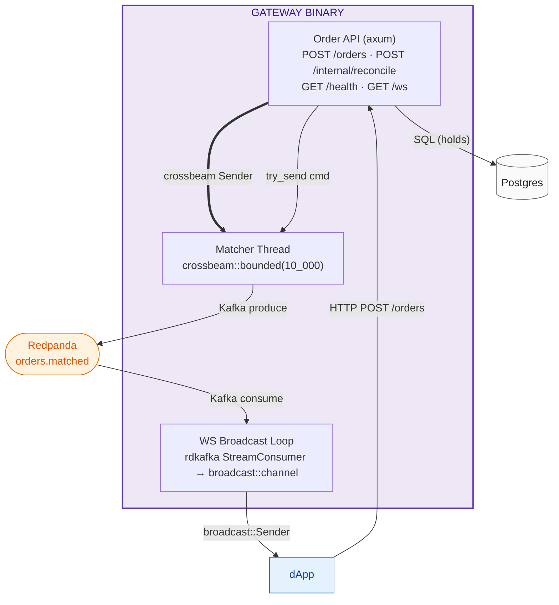
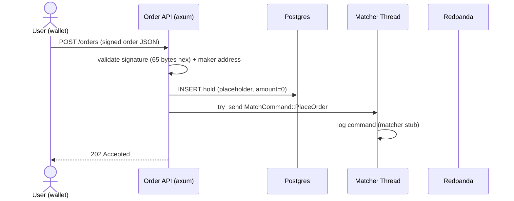
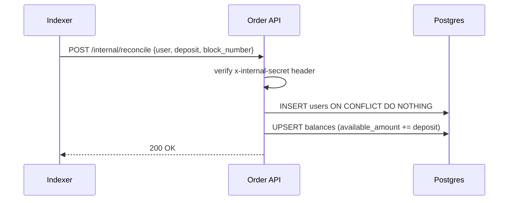

# Gateway

Public-facing entry point for user orders and WebSocket streaming. Single binary combining axum HTTP/WS server with a dedicated matcher thread.

**Source:** `backend/gateway/src/main.rs`
**Port:** `:8080` (only public service)
**Dependencies:** Postgres, Redpanda, crossbeam channel

## Architecture

## Endpoints

| Method | Path | Auth | Description |
|---|---|---|---|
| POST | `/orders` | — | submit signed order; validates signature is 65-byte hex + has `maker` field; inserts hold placeholder; enqueues to matcher |
| POST | `/internal/reconcile` | `x-internal-secret` header | called by Indexer to credit deposits post-finality; upserts `users` + `balances` |
| GET | `/health` | — | checks Postgres `SELECT 1` + Kafka metadata fetch; returns `{status, db, kafka}` |
| GET | `/ws` | — | WebSocket upgrade; subscribes to `broadcast::Receiver<Value>` fed by Kafka consumer |

## Matcher Thread

Spawned via `std::thread::Builder` (not tokio) — sync thread receiving `MatchCommand` from a bounded `crossbeam::channel::bounded(10_000)`. Currently logs received commands. The matching engine logic (price-time priority, self-trade prevention, allocation-free hot path) is the documented design target.

## WS Broadcast Loop

Async tokio task consuming from Redpanda topic `orders.matched` (consumer group `gateway-ws-group`). Each message is parsed as JSON and sent via `broadcast::channel(1024)`. Commits offsets asynchronously after processing.

## Order Submission Flow

## Reconcile Flow

## Shared Domain Types

The `shared` crate (`backend/shared/src/domain.rs`) provides:

- **`Address`** — `[u8; 20]` newtype with hex serde
- **`MarketId`** — `[u8; 32]` newtype with hex serde
- **`Bytes32`** — `[u8; 32]` newtype with hex serde
- **`Price`** — `u64` newtype, `SCALE = 1_000_000`
- **`Quantity`** — `u64` newtype
- **`OrderId`** — `Uuid` newtype
- **`BatchId`** — `[u8; 32]` newtype
- **`OrderSide`** — enum `Buy = 0`, `Sell = 1`
- **`Order`** — mirrors `SettlementExchange.Order` (includes `signer`, `condition_id`, `parent_collection_id` for off-chain EIP-712 hashing)
- **`SignedOrder`** — `Order` + `Vec<u8>` signature
- **EIP-712 helpers:** `compute_domain_separator`, `hash_order`, `eip712_signing_hash`, `verify_order_signature`

## Configuration

Loaded from environment via `shared::config::AppConfig`:

- `GATEWAY_BIND` — listen address (default `0.0.0.0:8080`)
- `GATEWAY_INTERNAL_SECRET` — shared secret for `/internal/reconcile`
- `DATABASE_URL`, `KAFKA_BROKERS`, `RPC_URL`, `CHAIN_ID`
- Contract addresses: `CUSTODY_ADDR`, `SETTLEMENT_EXCHANGE_ADDR`, `ORACLE_ADDR`, `CTF_ADDR`, `USDC_ADDR`
- `OPERATOR_KEY` — hex private key (dev only; KMS in production)
- `LLM_API_URL`, `LLM_API_KEY` — for Resolution Service
- `LOG_FORMAT` — `pretty` or `json`
