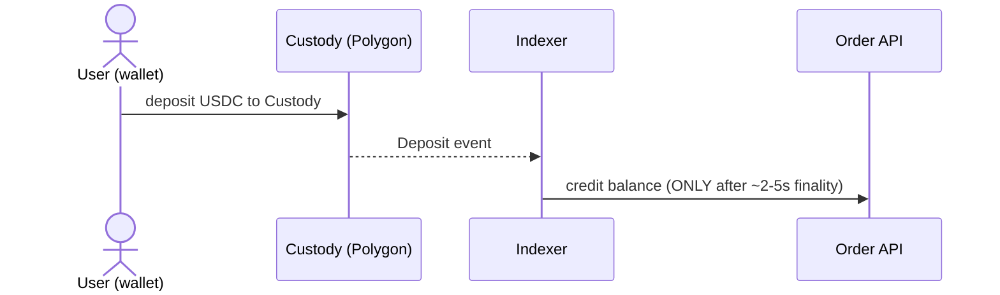
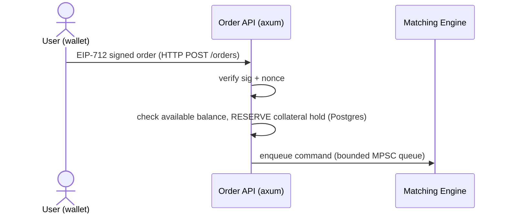
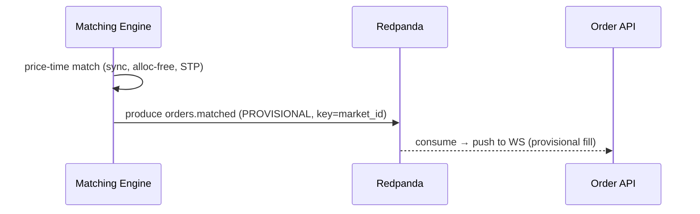
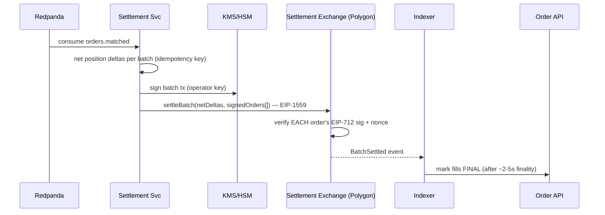
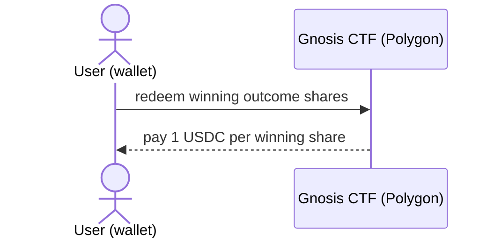
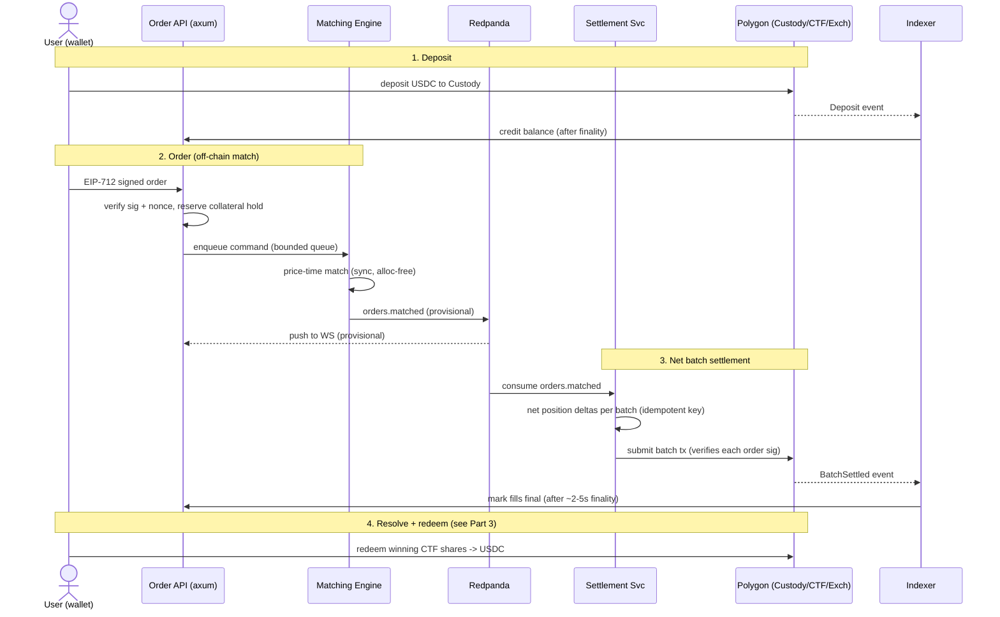
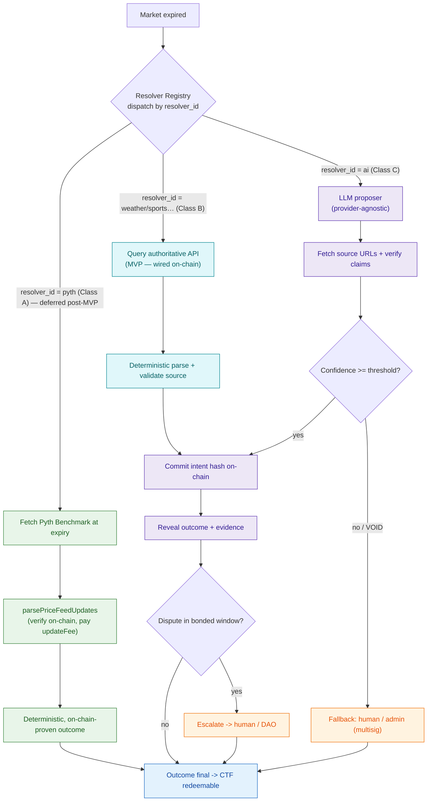
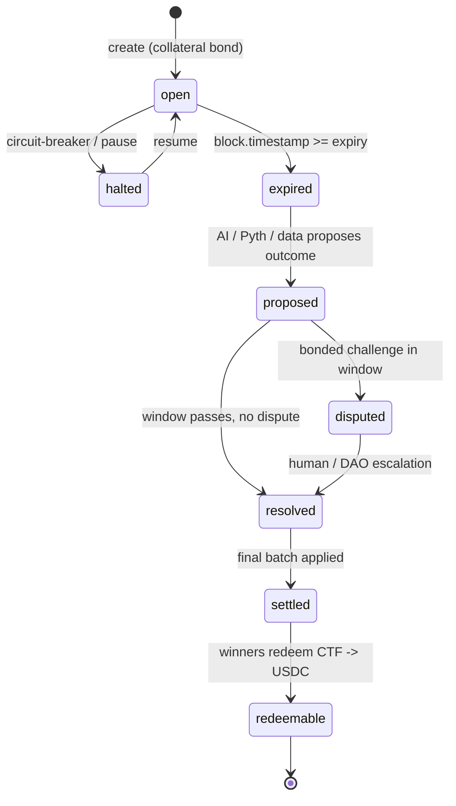
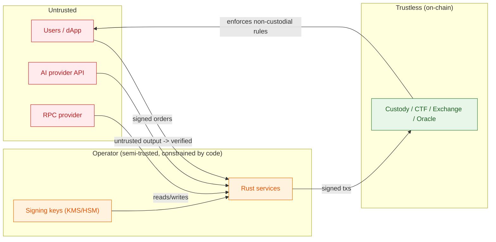

# Omniscient — How It Works

> **Single source of truth.** This document explains what Omniscient is and walks the entire system end-to-end, step by step, following one trade through its full lifecycle (the *happy path*), then covers the supporting detail: components, resolution, state ownership, fund-safety, and trust boundaries.
>
> Reflects the locked decisions in `.devin/rules/omniscient.md`: Polygon PoS, off-chain Rust CLOB, Redpanda durable log, AI optimistic-oracle resolution. **MVP-first:** the fewest moving parts that are correct and fund-safe. Class A (Pyth on-chain auto-finalize) is **deferred post-MVP**.

---

## Part 0 — What Omniscient Is

**Omniscient is a non-custodial, continuous prediction market where anyone can create a market on any factual question, and resolution is decided by data sources or an AI proposer — not by a company.**

It fixes four problems with existing platforms:

- **Few questions** → anyone can permissionlessly create a market on any answerable question (behind an anti-spam bond).
- **Slow payouts** → resolution happens in seconds-to-minutes via data feeds or an AI proposer, not a human referee over days/weeks.
- **Custodial risk** → your USDC sits in transparent smart contracts, not a company account. Every trade must be signed by *you*; the operator cannot fabricate trades or move funds.
- **Referee can cheat** → the AI's answer is **committed on-chain (hashed) before it is revealed**, then exposed to a bonded dispute window — so it cannot be silently altered.

**Units everywhere:** price is in `[0,1]` scaled to `1e6`; a complete CTF outcome set = `1 USDC`; a winning share redeems for `1 USDC`; USDC has `6` decimals.

---

## Part 1 — The Cast (components in one line each)

| Zone                    | Component                                              | One-line role                                                                                      |
| -------------------------| --------------------------------------------------------| ----------------------------------------------------------------------------------------------------|
| **Untrusted**           | Web UI / dApp                                          | User wallet; signs EIP-712 orders; submits/queries; renders live feed.                             |
| **Operator (Rust)**     | Gateway (Order API + Matching Engine)                  | Verifies signed orders, holds collateral, matches off-chain (single-writer per market).            |
| **Operator (Rust)**     | Settlement Service                                     | Consumes matches, nets position deltas, submits batched on-chain txs, waits for finality.          |
| **Operator (Rust)**     | Resolution Service                                     | On market expiry, dispatches to a resolver (data API / AI) and drives commit-reveal.               |
| **Operator (Rust)**     | Chain Indexer                                          | The **only** path back from finalized chain state → off-chain (credits, finality, reorg rollback). |
| **Tooling**             | Redpanda                                               | Durable event log (Kafka API) — durability, replay, decoupling, audit. **Not** throughput.         |
| **Tooling**             | Postgres                                               | Operational store: open orders, holds, nonces, batch state, audit. Never the fund authority.       |
| **Trustless (Polygon)** | Custody/Vault, Settlement Exchange, Gnosis CTF, Oracle | Hold USDC, apply net deltas, mint/redeem outcome tokens, commit-reveal resolution.                 |

**Two invariants the topology enforces:**

- The **Matching Engine never touches the chain or DB** — it only consumes commands (in-process) and produces matches (Kafka).
- **Settlement and Resolution are the only writers to Polygon; the Indexer is the only reader back.**

**Process topology (MVP):** 4 Rust processes + 2 stateful tools.

```
 gateway      (Order API + WS + Matching Engine, 1 binary)   :8080 public
 settlement   (consumes matches, submits batches)            :7002 metrics
 resolution   (LLM/data proposer + commit/reveal)            :7003 metrics
 indexer      (chain → off-chain reconciliation)             :7004 metrics
 redpanda     (single binary, no JVM/ZK)                     :9092 / :9644 / :8081
 postgres                                                    :5432
 external:    Polygon RPC · LLM provider · KMS/HSM · Safe multisig
```

Only `gateway:8080` is public. Everything else is operator-internal.

---

## Part 2 — The Happy Path, Step by Step

This is one full lifecycle: a market is created, two users deposit and trade, the trade is matched and settled on-chain, the market expires and resolves, and the winner redeems. Each step names **who acts, what moves, the transport, and the source of truth**.

### Overview diagram

```mermaid
flowchart TB
    subgraph Client["CLIENT (untrusted)"]
        UI["Web UI / dApp<br/>wallet · EIP-712 signing"]
    end

    subgraph OffChain["OFF-CHAIN SERVICES (Rust, operator)"]
        direction TB
        API["Order API + WS<br/>axum"]
        ME["Matching Engine<br/>single-writer / market"]
        SETT["Settlement Service<br/>alloy · EIP-1559"]
        RES["Resolution Service<br/>provider-agnostic LLM"]
        IDX["Chain Indexer<br/>on/off-chain reconcile"]
        PG[("Postgres<br/>orders · holds · audit")]
    end

    subgraph Broker["REDPANDA — durable event log (Kafka API)"]
        direction LR
        T1(["orders.matched"])
        T3(["settlement.batches"])
        T4(["resolution.events"])
    end

    subgraph Chain["POLYGON PoS — on-chain (trustless)"]
        direction TB
        CUST["Custody / Vault<br/>USDC · EIP-712 verify"]
        EXCH["Settlement Contract<br/>net deltas · batched"]
        CTF["Gnosis CTF<br/>ERC-1155 outcomes"]
        ORACLE["Oracle<br/>commit-reveal · dispute"]
        PYTH["Pyth pull oracle<br/>+ Benchmarks<br/>(deferred post-MVP)"]
    end

    UI -->|"1 · deposit USDC"| CUST
    UI -->|"2 · signed order (HTTP)"| API
    API <-->|"live feed (WS)"| UI
    API -->|"3 · enqueue cmd"| ME
    ME -->|"4 · publish match"| T1
    T1 -->|"5a · consume"| SETT
    T1 -->|"5b · broadcast"| API
    SETT -->|"6 · net batch tx"| EXCH
    SETT -.->|audit| T3
    EXCH --> CUST
    EXCH --> CTF
    RES -->|"7 · commit/reveal"| ORACLE
    RES -.->|audit| T4
    ORACLE -.->|price markets<br/>(post-MVP)| PYTH
    ORACLE -->|"8 · set outcome"| CTF
    UI -->|"9 · redeem shares"| CTF
    Chain ==>|events| IDX
    IDX -->|"collateral & finality"| API
    IDX --> PG
    API --> PG
    SETT --> PG

    classDef client fill:#e3f2fd,stroke:#1565c0,color:#0d47a1;
    classDef svc fill:#ede7f6,stroke:#5e35b1,color:#311b92;
    classDef broker fill:#fff3e0,stroke:#ef6c00,color:#e65100;
    classDef chain fill:#e8f5e9,stroke:#2e7d32,color:#1b5e20;
    classDef store fill:#fafafa,stroke:#616161,color:#212121;
    class UI client;
    class API,ME,SETT,RES,IDX svc;
    class PG store;
    class T1,T3,T4 broker;
    class CUST,EXCH,CTF,ORACLE,PYTH chain;
    class PYTH deferred
```

### Step 0 — Market creation

- **Who:** a creator (any user) via the dApp.
- **What:** posts a question with a clear expiry and a `ResolutionSpec` naming a `resolver_id` (e.g. `weather`, `ai`) plus resolver params. Posts a refundable **anti-spam collateral bond**.
- **Validation:** the resolver registry runs `validate_spec` at creation. **A market cannot be created with a spec no resolver can answer.**
- **Result:** market enters state `open`. Outcome tokens are defined via Gnosis CTF.

### Step 1 — Deposit (off-chain credit only after finality)



- **Who:** trader. **What:** sends USDC to the Custody/Vault contract (their wallet signs the tx).
- **Source of truth:** the Custody contract balance. The Indexer observes the `Deposit` event and, **only after deterministic finality (~2–5s, Heimdall v2)**, credits the off-chain available balance via `POST /internal/reconcile` to the Order API.
- ⚠️ Pre-finality deposits are **not** spendable — the indexer rolls back on reorg before finality.

### Step 2 — Place an order (signed, collateral reserved on accept)



- **Who:** trader signs an EIP-712 order; the dApp sends it to `POST /orders`.
- **Gateway checks, in order:** (1) EIP-712 signature valid; (2) nonce unused (replay protection); (3) available balance ≥ required collateral; (4) **reserve the collateral hold in Postgres before the order enters the book.**
- **Then:** the validated order is enqueued as a command on the bounded in-process queue to the Matching Engine.
- **Fund-safety:** orders enter the book **only after** the hold is placed. Uncollateralized orders are never matched. Submission is rate-limited.

### Step 3 — Match (single-writer, deterministic, off-chain)



- **Who:** the single matcher thread that owns this market's book.
- **How:** strict **price-time priority**, **self-trade prevention**, supports limit/IOC/FOK/post-only, partial fills, and cancel/amend — all through the **same serialized command stream**. The hot path is sync and allocation-free (no `.await`, no locks, no heap alloc). Target `<1ms`.
- **Output:** a **provisional** match published to `orders.matched`, keyed by `market_id` (preserves per-market ordering).
- **Live feed:** the Order API consumes `orders.matched` and pushes the fill to the user's WebSocket.
- ⚠️ **INVARIANT:** the WS feed is **provisional**. Clients must render fills as provisional until the indexer confirms finalized settlement. This is pre-settlement state — never treat it as settled.
- **Fee↔solvency:** maker rebate (`0.1%`) is funded strictly by the taker fee (`0.5%`) → net protocol fee `≥ 0` per match. Rounding always favors the pool.

### Step 4 — Net-batch settlement (the only on-chain write for trades)



- **Who:** the Settlement Service consuming `orders.matched`.
- **How:** it **nets position deltas across a batch** (not per match), assigns a **per-batch idempotency key**, signs via KMS/HSM (operator key — **never** user funds), and submits one batched tx via EIP-1559 with priority-fee bumping and nonce/replacement on stuck txs.
- **On-chain enforcement:** the Settlement Exchange **re-verifies each order's EIP-712 signature + nonce** — this is what makes the system non-custodial. The operator cannot fabricate a trade because every settled delta traces to a user signature.
- **Idempotency:** the settlement→chain boundary has its **own** idempotency key + on-chain dedup. Broker exactly-once is **within-broker only** and does not cross this boundary. A retry cannot double-apply.
- **Finality:** the service waits ~2–5s for deterministic finality before marking the batch settled. The Indexer observes `BatchSettled` and marks the fills **final** to the Order API.
- **Backpressure:** bounded settlement backlog → slow/halt matching rather than let pre-settlement state diverge unbounded. Batch size is tuned to **gas**, not a magic number.

### Step 5 — Expiry

- **Trigger:** `block.timestamp >= expiry`. Market transitions `open → expired`.
- **Canonical time:** expiry and dispute windows key off **on-chain block timestamp**, not the scheduler clock.

### Step 6 — Resolution (optimistic oracle, pluggable resolvers)

The Resolution Service dispatches the expired market through the **resolver registry** by its `resolver_id`. See Part 3 for the full model. Summary of the happy path:

- **AI proposer (MVP):** the LLM proposes outcome + confidence + evidence, **fetches and verifies cited sources**, commits the intent hash on-chain, reveals, then rides the bonded dispute window.
- **Deferred post-MVP:** deterministic on-chain sources (e.g. Pyth Benchmarks via `parsePriceFeedUpdates` → auto-finalize) and trusted-API sources. They plug in behind the same `Resolver` trait but are **not** wired in the MVP.
- **MVP:** every market binds to the **AI resolver**; resolution is the single commit-reveal + dispute path.

On the happy path, the dispute window passes with **no dispute** → the Oracle finalizes the outcome and sets it on the CTF. Market: `proposed → resolved → settled`.

- **Async:** resolution latency (2–15s) **never blocks settlement**.

### Step 7 — Redeem



- **Who:** the winner. **What:** redeems winning CTF (ERC-1155) shares for `1 USDC` each, directly from the contract — no company processes the withdrawal.
- Market: `settled → redeemable → done`.

### Full trade sequence (condensed)



---

## Part 3 — Resolution in Detail (Optimistic Oracle)

Resolution is a **registry of resolvers**, not two hardcoded branches. Each market's `ResolutionSpec` names a `resolver_id`; the registry dispatches by **explicit lookup**. There is no implicit "Pyth if price, AI otherwise" — AI is simply the catch-all resolver a creator selects when no structured source fits.

> **MVP scope:** Class A (Pyth) is **deferred post-MVP**. The on-chain Oracle contract only implements Class B and Class C (both commit-reveal + dispute).



### Verification classes (drives the finalization path)

| Resolver | Meaning | Examples | Finalization | MVP? |
|---|---|---|---|---|
| **AI** | Open-ended fact, no structured source | LLM proposer | Commit-reveal + full bonded dispute window + mandatory source-fetch/verify | **wired (MVP)** |
| On-chain (deferred) | Cryptographically verifiable **on-chain** | Pyth Benchmarks (`parsePriceFeedUpdates`) | Auto-finalize — proof checked on-chain | deferred post-MVP |
| Trusted API (deferred) | Single **trusted off-chain** source, deterministic parse | Weather / sports-results API | Commit-reveal + bonded dispute window | deferred post-MVP |

### The `Resolver` abstraction

Every backend implements one trait so new sources of truth are added without touching the engine, the Oracle contract, or settlement:

```rust
trait Resolver {
    fn id(&self) -> &'static str;                 // e.g. "pyth", "weather", "ai"
    fn class(&self) -> VerificationClass;         // A | B | C — drives finalization path
    fn validate_spec(&self, spec: &ResolutionSpec) -> Result<(), SpecError>; // @ market creation
    async fn resolve(&self, m: &ExpiredMarket) -> Result<ResolutionProposal, ResolveError>;
}
```

- **`ResolutionSpec`** (set + validated at creation) names `resolver_id` + resolver-specific params. `validate_spec` rejects any unresolvable market.
- **`ResolutionProposal`** = `{ outcome, evidence, confidence, class }`; `evidence` is an on-chain proof (Class A) or cited-source bundle (Class B/C).

### Key properties & hazards

- **Pluggable, not branched.** Adding a source = implement `Resolver` + register an id. Class B/C need **no** contract change; Class A adds an on-chain proof-check path to the Oracle.
- **Every Class B source offloads the AI** → shrinks the AI surface (hallucination, timeout, cost) with the same dispute-window safety net.
- ⚠️ **CLASS-COLLAPSE HAZARD:** never treat Class B like Class A. A web API can lie, go down, or be MITM'd — only the bonded dispute window protects funds for B/C. Auto-finalize is reserved for proofs the **Oracle contract itself** can verify.
- **AI is a proposer, not the oracle.** Economic dispute + on-chain commit-reveal provide neutrality, not the model. **Never finalize on raw model output** — source fetch + claim verification is mandatory.
- **Pre-commitment binds** the concrete output + cited evidence; *verification* (not regeneration) is the reproducible step. Temperature 0; **no** assumption of bit-identical re-runs.
- **Pyth specifics:** validate staleness/confidence/status; expiry markets use **Benchmarks at expiry**, never a live spot read; pay `getUpdateFee`.

---

## Part 4 — Market Lifecycle State Machine



Illegal transitions **revert on-chain**. Off-chain services treat state as authoritative only from finalized chain state.

---

## Part 5 — Event / Topic Design (Redpanda)

| Topic | Producer | Consumers | Key | Notes |
|---|---|---|---|---|
| `orders.matched` | Matching Engine | Settlement, WS Broadcaster | `market_id` | Per-market ordering; isolated consumer groups |
| `positions.updated` | Settlement | Indexer, API | `user_id` | Compacted |
| `settlement.batches` | Settlement | Indexer, audit | `batch_id` | Idempotency key per batch |
| `resolution.events` | Resolution | Indexer, audit | `market_id` | Versioned schema; includes `resolver_id` + `class`; legal/audit record |

Broker justified by **durability, replay, decoupling, audit** — not throughput. All payloads carry an explicit schema version; commit offsets **after** processing; DLQ for poison messages; bounded exponential backoff on retries.

⚠️ **INVARIANT:** broker exactly-once is **within-broker only** — it does not extend across the settlement→chain boundary.

---

## Part 6 — Source of Truth & Reconciliation

| State | Provisional source | Authoritative source |
|---|---|---|
| Balances / collateral | API holds (Postgres) | Custody contract (via indexer, post-finality) |
| Fills / positions | `orders.matched` (WS) | Settlement contract / CTF (post-finality) |
| Market outcome | Resolver proposal (Pyth / data API / AI) | Oracle contract — Class A on-chain proof, else post dispute window |
| Order book | In-memory (Matching Engine) | Rebuilt from snapshot + replay-from-offset |

**Finality & reorg:** settlement is final only after Polygon deterministic finality (~2–5s, Heimdall v2). The Indexer **rolls back** off-chain state on reorg before finality. Clients render pre-settlement matches as **provisional**.

**Crash recovery:** the in-memory book is rebuildable via periodic snapshot + replay-from-offset.

---

## Part 7 — Fund-Safety Invariants (cross-cutting, non-negotiable)

- **Solvency / conservation:** collateral pool ≥ total owed to winners at all times; matching, fees, settlement, and rounding never create or destroy value; **rounding always favors the pool.**
- **Non-custodial:** trades settle only from EIP-712-signed user orders; the operator cannot fabricate trades. A **forced-withdrawal / escape-hatch** path is preserved in the v1 custody design.
- **Pre-trade collateralization:** orders enter the book only after balance is verified against indexed on-chain custody; collateral is reserved on accept; withdrawals exclude held collateral; deposits credited only after finality.
- **Fee↔solvency coupling:** maker rebate (`0.1%`) funded strictly by taker fee (`0.5%`) — net protocol fee `≥ 0` per match.
- **Settlement idempotency:** per-batch key + on-chain dedup so a retry cannot double-apply.
- **Backpressure:** bounded settlement backlog; slow/halt matching rather than let pre-settlement state diverge unbounded.
- **Canonical time:** expiry/dispute windows key off on-chain block timestamp.

---

## Part 8 — Trust Boundaries & Compliance



- User input, AI output, and RPC responses are **untrusted** — validate/verify everything.
- Operator services are constrained by on-chain rules: they **cannot** move funds without user signatures.
- Privileged on-chain actions sit behind **Safe multisig + timelock**; a pausable circuit-breaker covers settlement, withdrawals, and resolution.
- Operator signing keys (settlement, resolution) live in **KMS/HSM** — never user funds.

⚠️ **COMPLIANCE:** prediction markets carry heavy regulatory exposure (US CFTC + state gambling law; Polymarket geofences the US). **Geofencing and legal review are first-class, present requirements** — chain choice provides no regulatory cover.

---

## Part 9 — On-Chain Contracts (Solidity / Foundry)

| Contract | Responsibility | Called by | Reuse |
|---|---|---|---|
| **Custody / Vault** | Holds USDC; EIP-712 deposit/withdraw; forced-withdrawal escape hatch | dApp (deposit/withdraw), Settlement | bespoke, OZ primitives |
| **Settlement Exchange** | Applies **net position deltas in batches**; verifies each order's EIP-712 sig + nonce | Settlement Service | evaluate Polymarket `CTFExchange` pattern |
| **Gnosis CTF** | ERC-1155 outcome tokens: split/merge/redeem vs USDC collateral | Exchange, dApp (redeem) | **reuse Gnosis CTF as-is** |
| **Oracle** | commit-reveal outcome + bonded dispute window | Resolution Service, disputers | bespoke (optimistic oracle) |
| **Pyth contract** | On-chain price verification (`parsePriceFeedUpdates`) | Resolution Service | **reuse Pyth deployment** |

- **Access control:** OZ `AccessControl`; every privileged action behind **Safe multisig + timelock**; pausable circuit-breaker on settlement, withdrawals, resolution.
- **Guards:** reentrancy (CEI + `nonReentrant`), signature replay (EIP-712 + nonces), oracle staleness, rounding favors the pool. Foundry unit + invariant/fuzz tests; Slither in CI.

---

## Part 10 — Build Order (dependency-aware MVP sequence)

1. **Contracts** (Foundry): Custody + reuse CTF → Settlement Exchange → Oracle. Invariant/fuzz tests + Slither.
2. **Gateway:** Order API (EIP-712 verify, holds in Postgres) + Matching Engine (deterministic, replay-tested).
3. **Redpanda topics** + schema versioning.
4. **Settlement Service:** net-delta batching, idempotent submission, finality wait.
5. **Indexer:** event ingestion, reorg handling, reconcile → Order API.
6. **Resolution Service:** build the `Resolver` trait + registry first; ship Pyth (Class A) → AI proposer (Class C) + commit-reveal; add Class B data-source resolvers incrementally without engine changes.
7. **Cross-cutting:** `tracing`, metrics + alert thresholds, circuit-breaker/pause wiring, KMS/HSM + Safe.

---

## Appendix — Communication Matrix (who → who)

| From | To | Transport | Payload / purpose |
|---|---|---|---|
| dApp | Order API | HTTP | submit/cancel signed order, queries |
| dApp | Order API | WS | subscribe live fills/book |
| dApp | Custody | RPC (wallet) | deposit / withdraw / redeem |
| Order API | Matching Engine | IPC | validated command stream (bounded queue) |
| Matching Engine | Redpanda | KAFKA | produce `orders.matched` |
| Redpanda | Settlement | KAFKA | consume `orders.matched` |
| Redpanda | Order API | KAFKA | consume `orders.matched` → WS |
| Settlement | Settlement Exchange | RPC | net-delta batch tx (+ finality wait) |
| Settlement | KMS/HSM | SIGN | sign operator tx |
| Settlement | Redpanda | KAFKA | produce `settlement.batches`, `positions.updated` |
| Resolution | LLM / data API | HTTP | proposal + source fetch/verify |
| Resolution | Pyth / Oracle | RPC | verify price, commit/reveal |
| Resolution | Redpanda | KAFKA | produce `resolution.events` |
| Indexer | Polygon RPC | RPC | poll/subscribe events, finality |
| Indexer | Postgres | SQL | write reconciled state |
| Indexer | Order API | HTTP | finality / collateral updates |
| {gateway,settlement,indexer} | Postgres | SQL | operational state |

**Transport legend:** `HTTP` request/response · `WS` server push · `KAFKA` Redpanda produce/consume · `RPC` Ethereum JSON-RPC · `SQL` Postgres · `IPC` in-process bounded queue · `SIGN` KMS/HSM signature.
