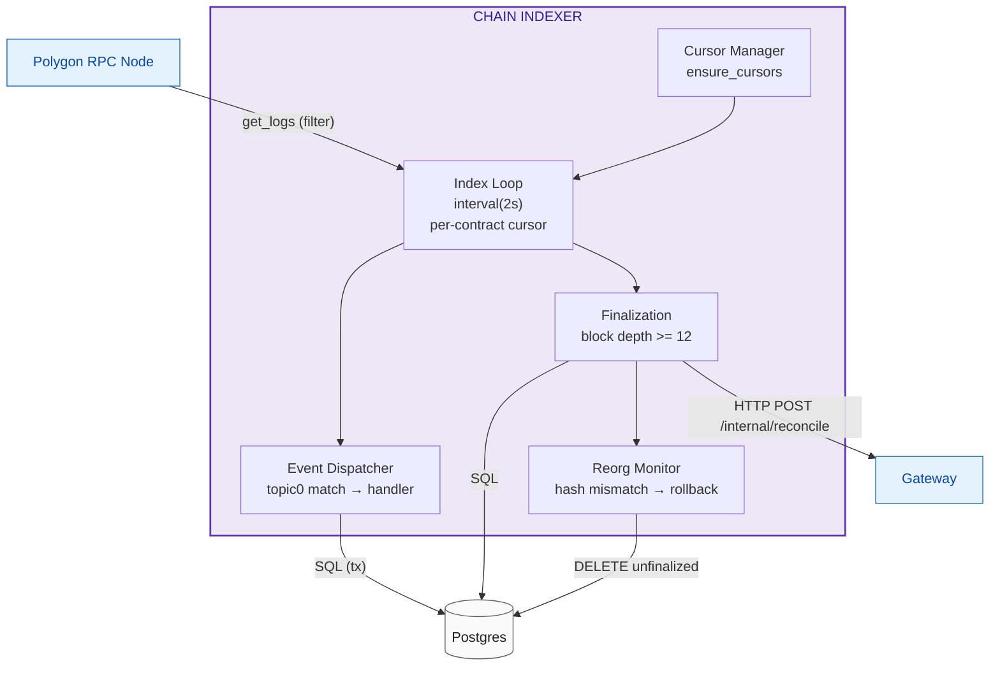

# Chain Indexer

Unidirectional pipeline synchronizing finalized on-chain state into Postgres and notifying the Gateway of credited deposits. Polls Polygon logs, tracks finality, detects reorgs, and dispatches events to per-contract handlers.

**Source:** `backend/indexer/src/` (lib crate with modules: `pipeline`, `events`, `finalization`, `reorg`, `cursor`, `abi`, `handlers/{custody, oracle, settlement}`)
**Dependencies:** Postgres, Polygon RPC (alloy)

## Architecture



## Index Loop (`pipeline.rs`)

Runs every 2 seconds. For each contract in `indexer_cursors`:

1. Read `last_finalized_block` from cursor
2. Fetch logs in batches of 50 blocks (`start = last+1`, `end = min(start+50, current)`)
3. For each log:
   - Check idempotency: `SELECT FROM indexed_logs WHERE tx_hash = $1 AND log_index = $2`
   - Insert `reorg_checkpoints` (block_number, block_hash, is_finalized=FALSE)
   - Dispatch to event handler within a Postgres transaction
   - Insert into `indexed_logs` on success
   - Commit transaction
4. Call `finalize_blocks` for the scanned range

## Finalization (`finalization.rs`)

For each block where `current_block - block_num >= FINALITY_BLOCKS` (12):

1. Fetch block hash from RPC
2. Compare against `reorg_checkpoints.block_hash`
3. **Mismatch → reorg:** call `reorg::rollback_unfinalized(block_num)`
4. **Match → finalize:** mark `is_finalized = TRUE`, update `indexer_cursors`
5. If contract is Custody: query `balances` for finalized deposits, POST `/internal/reconcile` to Gateway (3 retries with exponential backoff)

## Reorg Rollback (`reorg.rs`)

Single transaction deleting all unfinalized state from `block_number` onward:

- `reorg_checkpoints` (unfinalized)
- `indexed_logs`
- `balances`
- `order_cancellations`
- `markets`
- `settlement_batches`
- `resolution_proposals`

## Event Dispatch (`events.rs`)

Topic-hash matching against known event signatures. Each match calls the corresponding handler in `handlers/{custody, oracle, settlement}.rs`.

### Handled Events

| Event | Handler | Source Contract |
|---|---|---|
| `Deposited(address,uint256,uint256)` | `custody::handle_deposited` | Custody |
| `Withdrawn(address,uint256,uint256)` | `custody::handle_withdrawn` | Custody |
| `ForcedWithdrawalExecuted(address,address,uint256)` | `custody::handle_forced_withdrawal_executed` | Custody |
| `OperatorHeartbeat(uint256)` | `custody::handle_operator_heartbeat` | Custody |
| `OperatorInactivityThresholdUpdated(uint256)` | `custody::handle_operator_inactivity_threshold_updated` | Custody |
| `FeeRatesUpdated(uint256,uint256)` | `custody::handle_fee_rates_updated` | SettlementExchange |
| `NetDeltasApplied(bytes32,uint256)` | `settlement::handle_net_deltas_applied` | Custody |
| `NonceInvalidated(address,uint256)` | `settlement::handle_nonce_invalidated` | SettlementExchange |
| `MarketCreated(bytes32,bytes32,uint256)` | `oracle::handle_market_created` | Oracle |
| `OutcomeProposed(bytes32,address,uint256[])` | `oracle::handle_outcome_proposed` | Oracle |
| `OutcomeDisputed(bytes32,address,string)` | `oracle::handle_outcome_disputed` | Oracle |
| `OutcomeResolved(bytes32,uint256[])` | `oracle::handle_outcome_resolved` | Oracle |
| `DisputeResolved(bytes32,uint256[])` | `oracle::handle_dispute_resolved` | Oracle |

## Cursor Management (`cursor.rs`)

`ensure_cursors` initializes `indexer_cursors` rows for `custody_addr`, `settlement_exchange_addr`, `oracle_addr` if not present.

## ABI Utilities (`abi.rs`)

- `topic_hash(sig)` — keccak256 of event signature
- `u256_to_bigdecimal` — U256 → BigDecimal
- `parse_u256_array(data)` — ABI-decodes a `uint256[]` from log data
- `parse_string(data)` — ABI-decodes a `string` from log data

## Postgres Schema

```sql
CREATE TABLE indexer_cursors (
    contract_address BYTEA PRIMARY KEY,   -- 20 bytes
    last_finalized_block BIGINT NOT NULL DEFAULT 0,
    last_finalized_block_hash BYTEA,      -- 32 bytes
    updated_at TIMESTAMPTZ NOT NULL DEFAULT now()
);

CREATE TABLE reorg_checkpoints (
    block_number BIGINT PRIMARY KEY,
    block_hash BYTEA NOT NULL,            -- 32 bytes
    is_finalized BOOLEAN NOT NULL DEFAULT FALSE,
    inserted_at TIMESTAMPTZ NOT NULL DEFAULT now()
);

CREATE TABLE indexed_logs (
    block_number BIGINT NOT NULL,
    tx_hash BYTEA NOT NULL,               -- 32 bytes
    log_index BIGINT NOT NULL,
    contract_address BYTEA NOT NULL,      -- 20 bytes
    topic0 BYTEA NOT NULL,                -- 32 bytes
    PRIMARY KEY (tx_hash, log_index)
);
```
