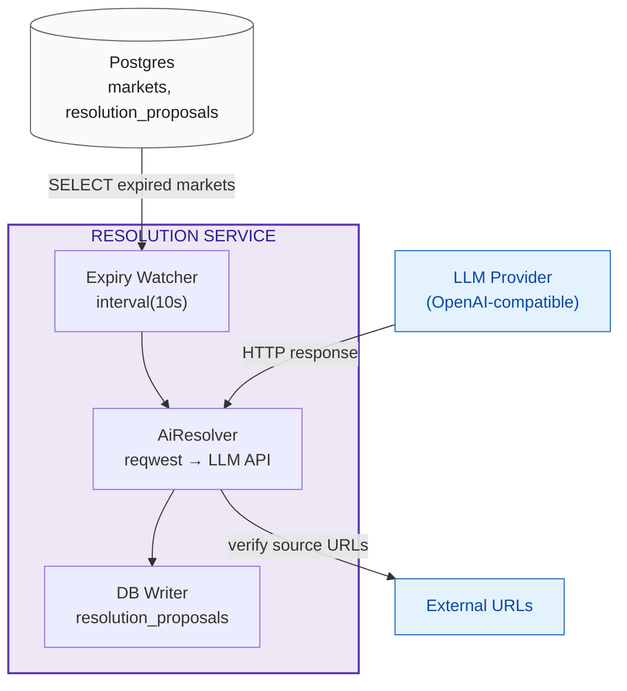
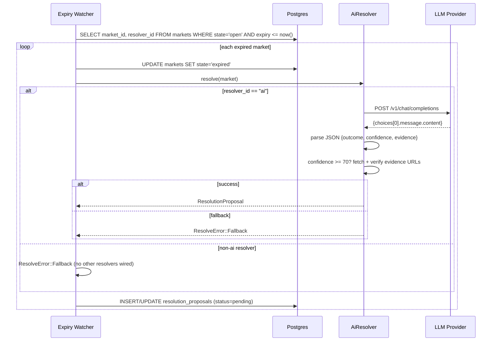

# Resolution Service

Async worker that monitors expired markets, dispatches them to an AI resolver, and stores proposals in Postgres. On-chain submission via `Oracle.proposeOutcome` is a deferred seam — the service currently produces `pending` proposals in the DB; the on-chain lifecycle (`PROPOSED → DISPUTED → RESOLVED`) is reconciled by the Indexer from Oracle events.

**Source:** `backend/resolution/src/main.rs`
**Dependencies:** Postgres, Polygon RPC (alloy provider, unused for tx), LLM API (reqwest)

## Architecture



## Resolver Trait

```rust
#[async_trait]
trait Resolver: Send + Sync {
    fn id(&self) -> &'static str;
    async fn validate_spec(&self, spec: &ResolutionSpec) -> Result<(), SpecError>;
    async fn resolve(&self, market: &ExpiredMarket) -> Result<ResolutionProposal, ResolveError>;
}
```

Only `AiResolver` is implemented. The trait is provider-agnostic — additional resolvers (trusted API, Pyth) plug in behind the same interface.

## AiResolver

- **API:** OpenAI-compatible chat completions endpoint (`LLM_API_URL` + `LLM_API_KEY`)
- **Model:** `gpt-4o`, `temperature: 0`
- **Timeout:** 30s
- **Confidence threshold:** < 70 → `ResolveError::Fallback` (human/DAO)
- **Source verification:** fetches each evidence URL; non-200 or fetch failure → `Fallback`
- **Payouts:** binary `[100 - outcome, outcome]` (percentages, not basis points)

## Expiry Watcher Loop



## ResolutionProposal

```rust
struct ResolutionProposal {
    outcome: u8,
    payouts: Vec<u64>,
    evidence: Vec<EvidenceItem>,  // { url, verified }
    confidence: u8,
}
```

## Off-Chain Integrity Hash

`compute_commitment(market_id, payouts)` = `keccak256(market_id.0 ++ payouts.map(U256::be_bytes))`. Stored in `resolution_proposals.commitment` for audit. This is **not** an on-chain commit-reveal commitment — the Oracle uses plaintext optimistic resolution.

## Postgres Schema

```sql
CREATE TABLE resolution_proposals (
    market_id BYTEA NOT NULL REFERENCES markets(market_id),
    round INT NOT NULL DEFAULT 0,
    resolver_id TEXT NOT NULL,
    commitment BYTEA,                     -- 32 bytes, off-chain integrity hash
    proposed_payouts NUMERIC(78,0)[],
    confidence INT CHECK (confidence >= 0 AND confidence <= 100),
    evidence JSONB,
    status TEXT NOT NULL,                 -- pending | committed | revealed | disputed | resolved
    proposer_address BYTEA,
    disputer_address BYTEA,
    dispute_reason TEXT,
    committed_at TIMESTAMPTZ,
    revealed_at TIMESTAMPTZ,
    finalized_at TIMESTAMPTZ,
    PRIMARY KEY (market_id, round)
);
```

## Markets Table

```sql
CREATE TABLE markets (
    market_id BYTEA PRIMARY KEY,
    condition_id BYTEA,
    question_id BYTEA NOT NULL,
    resolver_id TEXT NOT NULL,
    class TEXT NOT NULL DEFAULT 'ai' CHECK (class = 'ai'),
    state TEXT NOT NULL,                  -- open | halted | expired | proposed | disputed | resolved | settled | redeemable
    expiry TIMESTAMPTZ,
    outcome_slot_count INT NOT NULL DEFAULT 2,
    block_number BIGINT NOT NULL DEFAULT 0,
    ...
);
```

## On-Chain Submission (Deferred Seam)

The service does not yet submit `proposeOutcome` transactions to the Oracle contract. The documented flow:

1. AI produces `pending` proposal in DB (current)
2. Operator or automated service submits `Oracle.proposeOutcome(marketId, payouts)` — deferred
3. Indexer reconciles on-chain `OutcomeProposed` / `OutcomeDisputed` / `OutcomeResolved` events into `resolution_proposals` status

The `commitment` field in the DB is an off-chain audit artifact, not an on-chain commitment.
