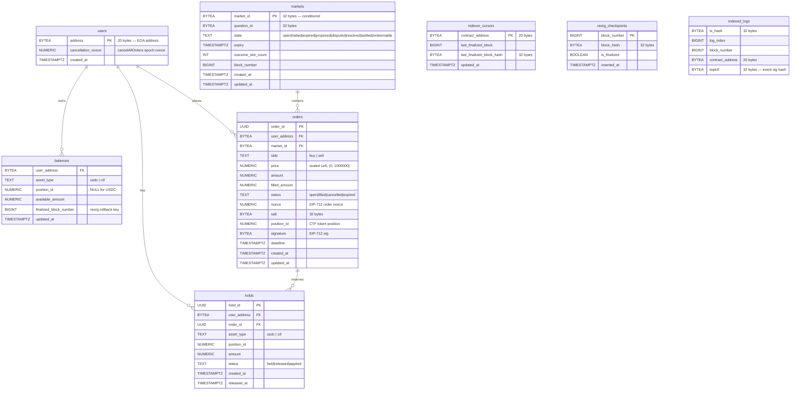
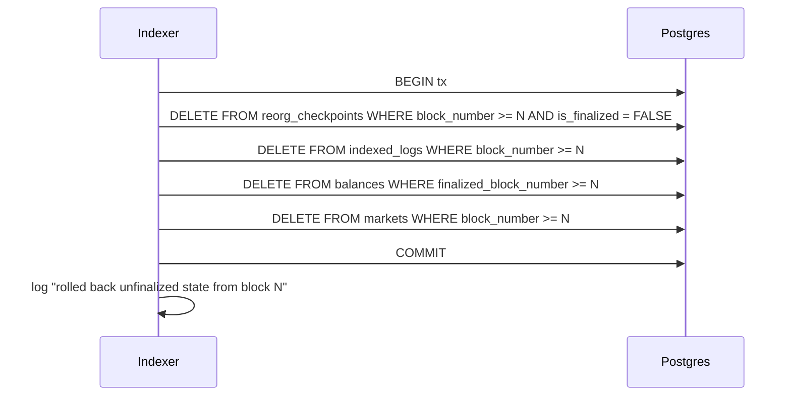
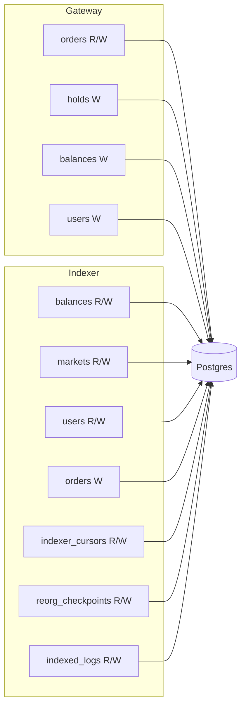

# Omniscient — Database Schema

Postgres is the off-chain state store. All tables are defined in `backend/schema.sql`. The schema is the persistence layer for two services: Gateway and Indexer.

## Design Conventions

- **`BYTEA` for EVM types**: Ethereum addresses (20 bytes), `bytes32` values (tx hashes, market IDs, salts, block hashes), and signatures are stored as raw binary. `CHECK (octet_length(...) = N)` enforces byte length at the DB level. This saves ~50% storage vs hex strings and avoids encode/decode overhead.
- **`NUMERIC(78,0)` for `uint256`**: Maps Solidity's `uint256` (max value `2^256 - 1` = exactly 78 decimal digits, 0 decimal places). Used for all on-chain-derived integer values: amounts, prices, nonces, position IDs.
- **`UUID` for internal IDs**: `orders.order_id` and `holds.hold_id` use `UUID DEFAULT gen_random_uuid()` (requires `pgcrypto` extension). These are internal-only, not derived from on-chain data.
- **`TIMESTAMPTZ`**: All timestamps are timezone-aware. `created_at` / `updated_at` default to `now()`.
- **Composite PK with `COALESCE`**: `balances` uses `COALESCE(position_id, -1)` in its PK because PostgreSQL disallows NULL in PK columns. USDC rows have `position_id = NULL`; CTF rows have a specific position ID.

## Entity-Relationship Diagram

## Tables

### `users`

EOA addresses known to the system. Populated by the indexer on `Deposited` events and by the gateway on internal reconcile calls.

| Column | Type | Notes |
|---|---|---|
| `address` | `BYTEA PK` | 20-byte EOA address. Natural PK — globally unique, immutable. |
| `cancellation_nonce` | `NUMERIC(78,0)` | Epoch nonce from on-chain `cancelAllOrders`. Updated by indexer on `NonceInvalidated` events. Orders with `nonce < cancellation_nonce` are mass-cancelled. |
| `created_at` | `TIMESTAMPTZ` | First seen. |

**Services**: Gateway (INSERT), Indexer (INSERT/UPDATE).

### `markets`

Prediction markets created via `Oracle.createMarket`. State transitions driven by on-chain events.

| Column | Type | Notes |
|---|---|---|
| `market_id` | `BYTEA PK` | 32 bytes — maps to CTF `conditionId`. |
| `question_id` | `BYTEA` | 32 bytes — CTF question ID. |
| `state` | `TEXT NOT NULL` | Lifecycle: `open → halted → expired → proposed → disputed → resolved → settled → redeemable`. |
| `expiry` | `TIMESTAMPTZ` | Market expiry. Nullable — should be set at creation. |
| `outcome_slot_count` | `INT` | Number of outcomes (≥2, default 2). |
| `block_number` | `BIGINT` | Block where market was created. Used for reorg rollback. |
| `created_at` / `updated_at` | `TIMESTAMPTZ` | Timestamps. |

**Services**: Indexer oracle handler (UPDATE), Indexer reorg (DELETE).

### `balances`

Post-finality chain-indexed balances. Written only after block finalization; rolled back on reorg.

| Column | Type | Notes |
|---|---|---|
| `user_address` | `BYTEA FK` | References `users.address`. |
| `asset_type` | `TEXT` | `'usdc'` or `'ctf'`. |
| `position_id` | `NUMERIC(78,0)` | NULL for USDC, specific CTF position ID for outcome tokens. |
| `available_amount` | `NUMERIC(78,0)` | Spendable balance (post-finality). |
| `finalized_block_number` | `BIGINT` | Block at which this balance was finalized. Reorg rollback key. |
| `updated_at` | `TIMESTAMPTZ` | Last update. |
| **PK** | composite | `(user_address, asset_type, COALESCE(position_id, -1))` — COALESCE maps NULL to -1 for PK eligibility. |

**Services**: Indexer custody handler (INSERT/UPDATE), Gateway reconcile (INSERT/UPDATE), Indexer finalization (SELECT), Indexer reorg (DELETE).

### `orders`

Off-chain order book state. Each row is an EIP-712 signed order submitted by a user.

| Column | Type | Notes |
|---|---|---|
| `order_id` | `UUID PK` | Internal ID, `DEFAULT gen_random_uuid()`. |
| `user_address` | `BYTEA FK` | Maker's EOA. |
| `market_id` | `BYTEA FK` | Market this order belongs to. |
| `side` | `TEXT` | `'buy'` or `'sell'`. |
| `price` | `NUMERIC(78,0)` | Scaled to 1e6. CHECK: `(0, 1000000]`. |
| `amount` | `NUMERIC(78,0)` | Original order quantity. CHECK: `> 0`. |
| `filled_amount` | `NUMERIC(78,0)` | Cumulative filled quantity. |
| `status` | `TEXT` | `open`, `filled`, `cancelled`, `expired`. |
| `nonce` | `NUMERIC(78,0)` | EIP-712 order nonce. |
| `salt` | `BYTEA` | 32-byte random value for signature uniqueness. |
| `position_id` | `NUMERIC(78,0)` | CTF token position. NOT NULL — every order targets a specific outcome. |
| `signature` | `BYTEA` | Raw EIP-712 signature. |
| `deadline` | `TIMESTAMPTZ` | Order validity expiry. |
| `created_at` / `updated_at` | `TIMESTAMPTZ` | Timestamps. |

**Services**: Gateway (INSERT/UPDATE/SELECT), Indexer settlement handler (UPDATE cancel).

**Indexes**:
- `idx_orders_user_status` — `(user_address, status)` — user's open orders lookup.
- `idx_orders_market_open` — `(market_id, status, side, price DESC)` — book rebuild / best-price queries.

### `holds`

Pre-trade collateral reservations. When an order is accepted into the book, the required collateral is held.

| Column | Type | Notes |
|---|---|---|
| `hold_id` | `UUID PK` | Internal ID. |
| `user_address` | `BYTEA FK` | User whose collateral is held. |
| `order_id` | `UUID FK` | Order that triggered the hold. `ON DELETE RESTRICT`. |
| `asset_type` | `TEXT` | `'usdc'` or `'ctf'`. |
| `position_id` | `NUMERIC(78,0)` | NULL for USDC holds. |
| `amount` | `NUMERIC(78,0)` | Held amount. CHECK: `> 0`. |
| `status` | `TEXT` | `held` → `released` (cancelled) or `applied` (settled). |
| `created_at` | `TIMESTAMPTZ` | When hold was created. |
| `released_at` | `TIMESTAMPTZ` | When hold was released/applied. |

**Services**: Gateway (INSERT only — release/apply logic not yet implemented).

**Indexes**:
- `idx_holds_user_active` — `(user_address, status) WHERE status = 'held'` — active holds per user.
- `idx_holds_released` — `(released_at) WHERE status = 'released'` — cleanup sweep.

### `indexer_cursors`

Per-contract block cursor for log polling. One row per watched contract address.

| Column | Type | Notes |
|---|---|---|
| `contract_address` | `BYTEA PK` | 20 bytes — contract to poll. |
| `last_finalized_block` | `BIGINT` | Highest finalized block processed. |
| `last_finalized_block_hash` | `BYTEA` | 32 bytes — hash of last finalized block (reorg detection). |
| `updated_at` | `TIMESTAMPTZ` | Last cursor advance. |

**Services**: Indexer cursor init (INSERT), Indexer pipeline (SELECT), Indexer finalization (UPDATE).

### `reorg_checkpoints`

Unfinalized block tracking for reorg detection and rollback.

| Column | Type | Notes |
|---|---|---|
| `block_number` | `BIGINT PK` | Block number. |
| `block_hash` | `BYTEA` | 32 bytes — block hash. |
| `is_finalized` | `BOOLEAN` | Whether this block has been finalized. |
| `inserted_at` | `TIMESTAMPTZ` | When checkpoint was created. |

**Services**: Indexer pipeline (INSERT), Indexer finalization (SELECT/UPDATE), Indexer reorg (DELETE).

**Index**: `idx_reorg_unfinalized` — `(block_number, is_finalized) WHERE is_finalized = FALSE`.

### `indexed_logs`

Idempotency table for event log processing. Prevents double-processing of chain events.

| Column | Type | Notes |
|---|---|---|
| `block_number` | `BIGINT` | Block containing the log. |
| `tx_hash` | `BYTEA` | 32 bytes — transaction hash. |
| `log_index` | `BIGINT` | Log index within block. |
| `contract_address` | `BYTEA` | 20 bytes — emitting contract. |
| `topic0` | `BYTEA` | 32 bytes — event signature hash. |
| **PK** | composite | `(tx_hash, log_index)` — unique per log. |

**Services**: Indexer pipeline (SELECT/INSERT), Indexer reorg (DELETE).

**Index**: `idx_indexed_logs_block` — `(block_number)` — reorg cleanup by block.

## Reorg Rollback

When a reorg is detected (block hash mismatch), the indexer rolls back all unfinalized state:

## Service Ownership

