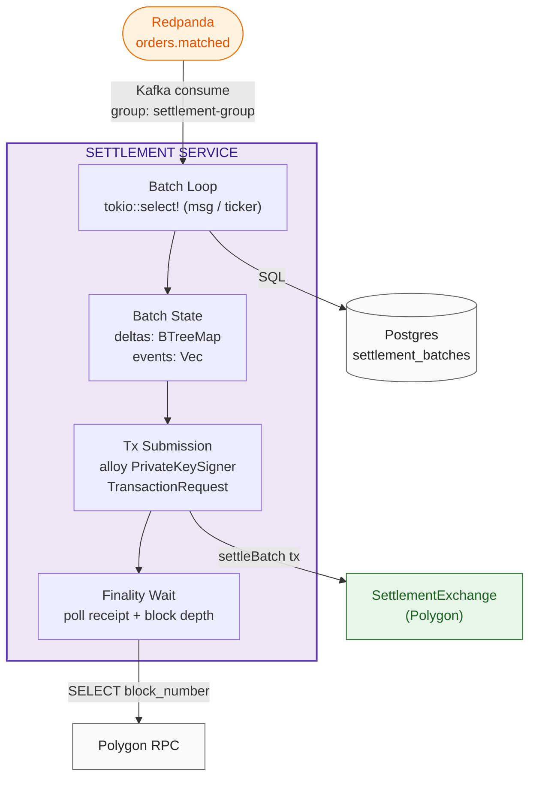
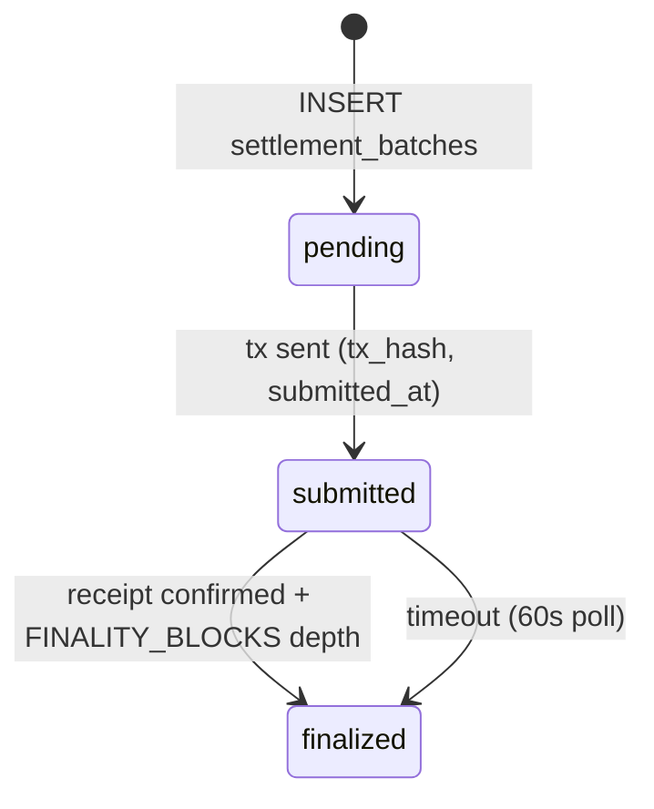

# Settlement Service

Operator-controlled worker that consumes matched orders from Redpanda, aggregates them into batches, and submits `settleBatch` transactions to `SettlementExchange` on Polygon.

**Source:** `backend/settlement/src/main.rs`
**Dependencies:** Redpanda (consumer), Postgres, Polygon RPC (alloy)

## Architecture



## Batch Loop

`tokio::select!` between two branches:

- **Kafka message:** deserializes `MatchEvent`, accumulates into `BatchState.deltas` (keyed by `(maker, "usdc")`) and `BatchState.events`. When `events.len() >= 50`, calls `submit_batch` and commits the Kafka offset.
- **5-second ticker:** if batch is non-empty and 5s elapsed since last submission, calls `submit_batch_timed` (no offset commit — timed batches don't have a message to commit).

## MatchEvent

```rust
struct MatchEvent {
    market_id: String,
    maker: String,
    taker: String,
    price: u64,
    amount: u64,
    side: String,
}
```

## Batch ID

`compute_batch_id` = `keccak256(serde_json::to_vec(&batch.deltas))` — deterministic hash of the delta map.

## Batch State Machine



## Finality Wait

Polls `provider.get_transaction_receipt(tx_hash)` every 1s for up to 60 attempts. Finality requires `current_block - receipt.block_number >= FINALITY_BLOCKS` (12 blocks). On timeout, logs warning and proceeds to mark finalized (current implementation does not retry or fail on timeout).

## Postgres Schema

```sql
CREATE TABLE settlement_batches (
    batch_id BYTEA PRIMARY KEY,          -- 32 bytes
    status TEXT NOT NULL,                 -- pending | submitted | finalized | failed
    tx_hash BYTEA,                        -- 32 bytes
    nonce BIGINT,
    gas_fee_cap NUMERIC(78,0),
    gas_tip_cap NUMERIC(78,0),
    block_number BIGINT NOT NULL DEFAULT 0,
    submitted_at TIMESTAMPTZ,
    finalized_at TIMESTAMPTZ,
    error TEXT,
    created_at TIMESTAMPTZ NOT NULL DEFAULT now()
);
```

## Current Limitations

- Tx submission sends `batch_id` as calldata input to `SettlementExchange` — does not yet encode `settleBatch` ABI with `SignedOrder[]`, `fills[]`, `isMaker[]`.
- No EIP-1559 fee bumping or nonce/replacement on stuck tx.
- Operator key loaded as raw `PrivateKeySigner` (dev only; KMS/HSM in production).
- Offset commit only on size-triggered batches, not timed batches.
